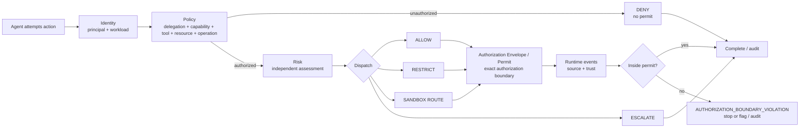

# Aegis Router

English | [简体中文](README.zh-CN.md)

**A Policy-Driven Security Router for AI Agents**

Aegis Router is a zero-trust security control plane that sits between AI agents and the tools and resources they act upon. Before each action, it evaluates the **principal, Agent workload identity, delegated authority, capability, tool, resource, operation, and constraints**. For an executable request it issues an explicit `AuthorizationEnvelope` (Execution Permit), then evaluates runtime events against that permit and retains an explainable audit chain. The API field is `authorization_envelope`; its identifier is `permit_id`.

> **Approving an Agent to exist does not approve its behavior.** Asset registration answers “may this workload participate in the governed environment?” Per-action authorization answers “may it use this delegation and this tool to perform this operation on this resource now?”

The GitHub repository retains the [`szey/agent-governance-gateway`](https://github.com/szey/agent-governance-gateway) name and URL to avoid a migration. The product is branded **Aegis Router**.

This codebase is a runnable MVP and reference implementation, not a production security boundary. It can demonstrate and test deterministic per-action authorization, risk-based dispatch, execution permits, adapter event ingestion, boundary evaluation, and audit. It has no universal endpoint sensor and cannot automatically stop an Agent that bypasses Aegis Router. `SANDBOX` is currently a route, not a connected isolation backend.

## Product center

Aegis Router puts runtime control first; filesystem discovery is not the primary product:

| Plane | Target weighting | Question |
|---|---:|---|
| Runtime Gateway / Enforcement | about 60% | Is this action authorized, and how should it be dispatched? |
| Runtime Observation + Audit | about 25% | Does execution remain inside the permit, and how trustworthy is the evidence? |
| Agent Inventory / Discovery | about 15% | Which registered workloads or unverified artifacts exist? |

Discovery is an optional asset-visibility module. A configuration, dependency, marketplace/cache entry, or manifest is discovery evidence; by itself it proves neither that an Agent is running nor the runtime risk of any action.

## One-action security loop



The investigation sequence remains `I → P → R → D → O → A`:

- **Identity**: who is acting and which Agent/workload acts for them;
- **Policy**: whether delegation scopes, capability, tool, resource, operation, and explicit constraints match;
- **Risk**: the sensitivity and uncertainty of an action that passed the authorization gate;
- **Dispatch**: `ALLOW / RESTRICT / SANDBOX / DENY / ESCALATE`;
- **Observation**: whether adapter or sensor events exceed the permit;
- **Audit**: the causal chain across request, decision, permit, evidence, violations, and final verdict.

A risk score never overrides an explicit authorization failure. A request without `finance.read`, for example, must be denied by policy rather than allowed because its numerical risk appears low.

## Security context and execution permits

Each `ActionRequest` represents the security context for one attempted action:

```text
PrincipalContext       human/service principal, tenant or environment
AgentIdentity          agent_id, workload_id, owner, environment, framework/version
DelegatedAuthority     credential fingerprint, issuer, subject, scopes, expiry
ToolContext            tool_id/name, provider, schema hash
ActionRequest          capability, operation, resource, side effect, destination
```

The system never needs to retain or audit a raw bearer token. `claimed_intent` may be contextual or risk metadata, but it is not the authorization boundary. Authorization primarily derives from:

```text
identity + delegated authority + capability + tool + resource + operation + constraints
```

An `ALLOW`, `RESTRICT`, or `SANDBOX` request receives a time-bounded permit tied to the request, principal, and Agent. `DENY` and `ESCALATE` do not receive an executable permit. A permit states what Aegis actually approved, for example:

```json
{
  "allowed_capability": "config.read",
  "allowed_tool": "config-reader",
  "allowed_resource": "protected_config",
  "allowed_operations": ["read"],
  "constraints": {
    "network_egress": "deny",
    "secret_access": "deny",
    "write_access": "deny"
  }
}
```

An Agent's declared plan may remain investigation context, but `declared plan != authorization boundary`; the issued permit is the security boundary.

## Current capabilities and evidence truth

| Capability | Current status | What it does—and does not—prove |
|---|---:|---|
| Structured action authorization | MVP implemented | Evaluates identity, delegation, capability, tool, resource, operation, and constraints for requests entering the API |
| Explicit execution permit | MVP implemented | Records the approved scope for one action; denied/escalated requests receive no permit |
| Policy/Risk separation | MVP implemented | Authorization failures deny first; risk only affects dispatch for authorized actions |
| Runtime event ingestion and permit evaluation | MVP implemented | Evaluates permit-bound events submitted by an adapter; Demo events come from server-owned fixtures |
| Per-action audit and causal chain | MVP implemented | Records requests entering the control point, decisions, risk, permits, evidence sources, and final verdicts |
| Demo Lab server-side fixture runner | Demo/regression | Sends fixed harmless events through the same permit checks and labels them `simulated_demo`; it is neither a real executor nor production telemetry |
| Local CLI wrapper | Experimental | Independently records the child lifecycle it starts; Agent JSONL remains self-reported evidence |
| Agent Inventory / configuration discovery | Optional, implemented | Finds config/dependency evidence in explicit roots and reconciles it with a local registry |
| Universal OS file/process sensor | Not connected | Cannot independently see arbitrary processes or file access |
| Network sensor | Not connected | Cannot independently see egress that bypasses the Router/adapter |
| Real sandbox isolation | Not connected | A `SANDBOX` route does not imply Docker/gVisor/Firecracker isolation |
| Enterprise auth, RBAC, multi-tenancy, central policy | Not implemented | The administrative control desk is for trusted local development/demo use |

Every runtime event must retain an evidence source and trust level:

| `source` | `trust_level` | Meaning |
|---|---|---|
| `gateway_enforced` | `enforced` | The request crossed an Aegis enforcement point |
| `instrumented_adapter` | `adapter_reported` | The caller claims adapter provenance; the MVP does not yet authenticate adapter identity |
| `agent_self_reported` | `self_reported` | The Agent or its log reported the event |
| `os_sensor` / `network_sensor` | `independent_sensor` | Usable only when that sensor is actually connected |
| `simulated_demo` | `simulated` | A synthetic Demo Lab event |

Uninstrumented coverage remains `UNKNOWN / not instrumented`; it must not appear as “zero gaps.”

The Event API validates source/trust pairing and permit binding, but it does not yet provide adapter authentication, cryptographic integrity, or replay defense. These labels describe an evidence claim, not independent attestation.

## Quick start

Go 1.26 is required. Node.js is needed only when editing the TypeScript frontend.

```bash
go run ./cmd/server
```

Open [http://localhost:8080](http://localhost:8080). Alternatively:

```bash
docker compose up --build
```

The control desk is runtime-first: Overview, Decisions, Audit / Investigations, Policies, Agent Inventory, and Demo Lab. The Overview does not dump marketplace/cache evidence.

### API direction

The primary flow separates pre-execution authorization from runtime evidence:

```text
POST /api/authorize
  → policy decision + risk assessment + dispatch decision
  → AuthorizationEnvelope / Permit only for an executable result

POST /api/runtime-events
  → event bound to request/permit
  → permit-boundary evaluation and violation result

POST /api/executions/{id}/complete
  → final verdict
```

Read APIs:

- `GET /api/decisions` — recent per-action authorization decisions;
- `GET /api/audits` — investigation and audit chains;
- `GET /api/runtime-coverage` — truthful coverage state for each telemetry class;
- `GET /api/agents` — Agent asset registrations;
- `GET /api/scenarios` — Demo Lab scenarios;
- `GET /api/discoveries` — optional discovery evidence.

Other current endpoints include `GET /api/health`, `GET /api/overview`, `GET /api/policies`, `POST /api/demo-lab/{id}/run`, and local Inventory management APIs. `POST /api/route` remains as a compatibility alias for `/api/authorize`, but it never presents client-submitted simulated actions as independent observation. `POST /api/runtime-events` accepts only `instrumented_adapter` or `agent_self_reported`; stronger labels are reserved for trusted internal integrations. Consult the running code and API response as the source of truth while these MVP endpoints evolve.

## Demo Lab

The six scenarios are deterministic security regressions, not production incidents:

| Scenario | Core result | Property under test |
|---|---|---|
| Safe code request | `ALLOW` + permit | Valid identity, delegation, tool, resource, and operation; demo event stays inside the permit |
| Unauthorized finance access | `DENY`, no permit | Code-scoped delegation cannot read finance; no executor invocation |
| Authorization-boundary violation | Violation after permit | Permit allows only `config.read`; `secret.read` or write triggers a boundary verdict |
| Indirect prompt injection | `DENY/ESCALATE` | Deterministic combination of untrusted provenance and a side-effecting tool |
| Protected file read | Restricted/sandbox route | Retain classified metadata and budget, not content or a full path |
| Sensitive read followed by egress | `DENY` or runtime violation | Cross-tool causality plus a denied-egress constraint |

Demo Lab events must be labeled `simulated_demo`. Only an adapter, gateway, or real connected sensor may use the corresponding non-demo source label.

## Agent Inventory (optional)

Discovery is disabled by default. Only when Inventory is needed, repeat `--discovery-root` for one or more explicitly approved roots. Without it, the runtime-first home page does not load the repository Shadow fixture:

```powershell
.\dist\agent-governance-gateway.exe `
  --addr "127.0.0.1:8080" `
  --discovery-root "C:\approved-agent-directory" `
  --discovery-root "D:\another-approved-root"
```

Or run the read-only scanner separately:

```bash
go run ./cmd/discover --path ./examples/shadow-agent-sample
```

The discovery module:

- reads only explicit roots, records inaccessible children as coverage gaps, and continues;
- retains relative evidence paths, types, fingerprints, and confidence—not file contents;
- groups marketplace/catalog/cache/temp artifacts under `Discovery Evidence / Available Integrations`;
- separates `available`, `installed`, `configured`, and `observed`;
- calls a workload Shadow only when deployment evidence exists but no registry entry matches;
- never treats a dependency string or MCP manifest itself as an independent Agent identity;
- separates discovery confidence/deployment state from the runtime risk of an attempted action.

The local asset registry may contain `agent_id`, `workload_identity`, display name, owner, environment, framework, approval reference, expiry, status, and `policy_profile`. Registration grants no behavioral permission; each action entering Aegis Router is still authorized and audited independently.

## Privacy defaults

The normal UI and runtime audit should not expose raw Windows usernames or full local paths. Resources are normalized into classes such as `USER_PROFILE / AGENT_CONFIG`, `WORKSPACE / SOURCE`, `PROTECTED_CONFIG`, and `SECRET_STORE`. If Inventory needs relative evidence paths, it keeps them separate from runtime audit records.

Never record raw tokens, secret values, or retrieved document contents. Prompt content is also excluded unless the operator explicitly chooses a local demo mode. Administrative and audit data remain inside the operator-approved data boundary.

## Documentation and pilot

Chinese is the semantic working source; English is synchronized in the same change:

| Topic | 简体中文 | English |
|---|---|---|
| Product brief | [中文](docs/project-brief.zh-CN.md) | [English](docs/project-brief.md) |
| Enterprise endpoint pilot | [中文](docs/experiments/enterprise-agent-pilot.zh-CN.md) | [English](docs/experiments/enterprise-agent-pilot.md) |
| Research, risk frameworks, and iteration | [中文](docs/research-product-mapping-iteration.zh-CN.md) | [English](docs/research-product-mapping-iteration.md) |
| Contributing | [中文](CONTRIBUTING.zh-CN.md) | [English](CONTRIBUTING.md) |
| Security policy | [中文](SECURITY.zh-CN.md) | [English](SECURITY.md) |

A company pilot is not “install and automatically monitor.” Only actions crossing the Router or events submitted by a connected adapter/sensor can be evaluated. A formal pilot requires renewed written authorization and synthetic data. See the [Enterprise Agent Endpoint Pilot](docs/experiments/enterprise-agent-pilot.md).

Ongoing research uses the separate `$research-to-product` skill; this repository is one consumer of that skill. [`.codex/research-to-product.json`](.codex/research-to-product.json) forbids automatic publishing, deployment, and production data.

## Development and verification

```bash
npm install
npm run check:web
npm run build:web
go test ./...
go test -race ./...
go vet ./...
```

The frontend source is `web/src/app.ts`; the compiled `web/static/app.js` is committed so a low-spec machine that only runs the repository binaries does not need Node.js.

## Roadmap

### Runtime Gateway / Enforcement

- [x] Deterministic default-deny policy and Policy/Risk separation
- [x] Explicit Agent, delegation, tool, resource, and operation context
- [x] `AuthorizationEnvelope` / permit and per-action audit
- [x] Runtime Event ingestion and permit-boundary evaluation
- [ ] Real MCP/HTTP/tool proxy enforcement points
- [ ] Human approval, permit revocation, and one-time authorization
- [ ] Signed identity, enterprise authentication, RBAC, and policy distribution

### Observation / Audit

- [x] Source/trust labels for Demo/adapter events
- [x] Deterministic inside-permit and boundary-violation results
- [x] Session, parent event, input provenance, and cross-tool sequence metadata
- [ ] Independent OS and network sensors
- [ ] Tamper-evident audit, durable causal state, and OpenTelemetry
- [ ] Real isolation executor and verifiable termination semantics

### Inventory / Discovery

- [x] Scoped scanning, fingerprints, deduplication, and local registry reconciliation
- [x] Separation of available integrations from deployed workloads
- [ ] Process, IdP/OAuth, CI/CD, and cloud-audit connectors
- [ ] Central enterprise inventory and full lifecycle management

## Security boundaries

- Aegis Router can authorize and audit only requests that enter its control point.
- Adapter or Agent self-reports may be incomplete and must retain provenance labels.
- Unconnected sensors are unknown, not zero-risk or zero-gap.
- A `SANDBOX` route is not host isolation unless a configured backend is independently verified.
- Discovery evidence can produce false positives and false negatives and does not prove execution.
- Local JSONL audit is not yet tamper-evident or a central enterprise store.
- A dedicated administrative header is not authentication or RBAC.
- Do not connect production credentials, customer data, or unrestricted internet before independent security review.

## License

[MIT](LICENSE)
