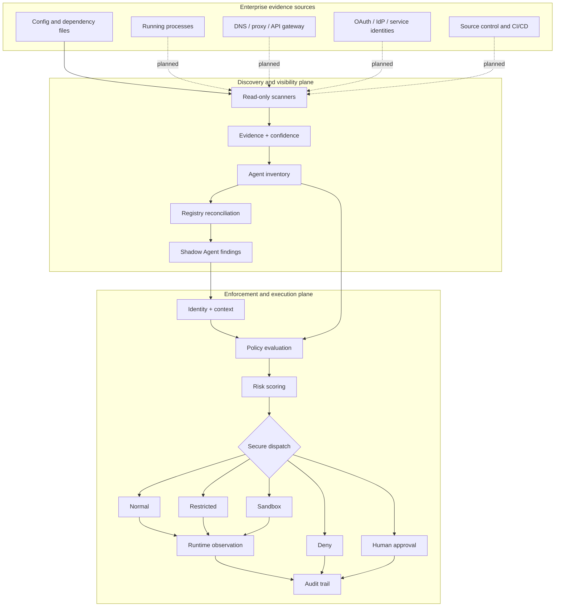

# Agent Governance Gateway

English | [简体中文](README.zh-CN.md)

**Discover, govern, and observe what AI agents do.**

Agent Governance Gateway is an open-source security control plane for AI agents. It combines an evidence-based discovery layer for finding unregistered agent workloads with an enforcement layer that evaluates identity, delegated authority, capability, resource sensitivity, and runtime behavior before an action is trusted.

It is designed around one distinction:

> **Discovery tells you an Agent exists. Asset approval decides whether it may exist. Enforcement and audit decide whether each action may occur and what evidence remains afterward.**

The approved registry is not a behavior allowlist. Even an approved Agent is evaluated on every routed action, and `allow`, `restrict`, `sandbox`, `deny`, and `escalate` decisions are all audited.

The current repository is a runnable MVP and reference architecture—not yet a production security boundary. The policy router, first configuration-based Shadow Agent scanner, and local approved registry are implemented. An experimental session observer records child-process lifecycle and privacy-preserving Agent JSONL evidence. The project has received sanitized feedback from one company-endpoint trial, but independent-sensor validation and resource measurement under the controlled pilot protocol are not complete. Live network, identity, and endpoint sensors remain planned work.

## Why this project exists

Prompt filtering is not enough once an agent can call tools, access credentials, modify files, query databases, or communicate with external systems. An enterprise needs answers to two different questions:

1. **What agents are operating in our environment, including agents nobody registered?**
2. **What may each agent do, and did its actual behavior stay inside that grant?**

Agent Governance Gateway addresses those questions through two cooperating planes.

## Architecture



Solid lines represent implemented paths. Dotted sensor paths are the enterprise roadmap.

## Current capability matrix

| Capability | Status | Notes |
|---|---:|---|
| Config/dependency Shadow Agent discovery | Implemented | Read-only scan of explicit roots; unreadable children become coverage gaps and scanning continues |
| Evidence, confidence, fingerprinting, deduplication | Implemented | Findings are grouped by project and agent type |
| Deployment-state classification | Implemented | Separates `available`, `installed`, and `configured`; marketplace/cache evidence is not automatically Shadow |
| Approved Agent registry and reconciliation | Implemented | Add, edit, suspend, or remove entries in the UI; save or rescan reconciles immediately |
| Capability and token-scope enforcement | Implemented | Unknown identities, resources, and scopes fail closed |
| Explainable risk-based routing | Implemented | `allow`, `restrict`, `sandbox`, `deny`, `escalate` |
| Planned-versus-observed action comparison | Implemented | Demonstrated with safe simulated executor actions |
| Append-only audit records | Implemented | Every valid Router request is recorded locally, whether allowed, denied, or escalated |
| Session causality and cross-tool sequence detection | Implemented | Parent events, provenance, accumulated risk; blocks sensitive-read-to-egress chains |
| Indirect prompt-injection metadata rule | Implemented | Deterministic untrusted-retrieval signal checks without retaining retrieved content |
| Protected-read audit and privacy budget | Implemented | Open/read class, byte count, and budget without full paths or contents |
| Tool identity and schema-hash check | Implemented | Default-deny when reported and approved schema hashes differ |
| Local agent session observer | Experimental | Records child-process lifecycle and normalizes JSONL event metadata without retaining commands or prompts |
| Live process discovery | Planned | Requires an OS-specific process sensor |
| Network/API behavior discovery | Planned | Requires egress proxy, DNS, API gateway, or service-mesh telemetry |
| OAuth/NHI discovery | Planned | Requires IdP and OAuth grant-log integration |
| Real sandbox isolation | Planned | Current `sandbox` is a dispatch result, not OS isolation |
| Central enterprise control plane | Planned | Durable inventory, RBAC, multi-tenancy, policy distribution |

## Quick start

Requires Go 1.26 or Docker.

### Run the policy router

```bash
go run ./cmd/server
```

Open [http://localhost:8080](http://localhost:8080). The control desk contains six deterministic scenarios:

| Scenario | Expected route | Security property |
|---|---|---|
| Safe coding request | `allow` | Valid identity, capability, scope, and target |
| Unauthorized finance access | `deny` | Resource denylist and delegated-scope mismatch |
| Behavioral drift during debugging | `sandbox` | Secret access and admin-tool use appear outside the declared plan |
| Indirect prompt injection | `deny` | Untrusted retrieved input carries tool-directive signals |
| Protected file read | `sandbox` | Only classified read metadata is retained and the privacy budget is charged |
| Sensitive read followed by egress | `deny` | Parent event and provenance form a cross-tool exfiltration sequence |

The last three controls apply only to events routed through Agent Governance Gateway or reported by an adapter. Agent Governance Gateway cannot yet independently see every file or network action that bypasses it; endpoint-wide coverage still requires OS, EDR, proxy, or gateway connectors.

With Docker:

```bash
docker compose up --build
```

### Find an unregistered Agent configuration

The repository includes a harmless Shadow Agent fixture:

```bash
go run ./cmd/discover --path ./examples/shadow-agent-sample
```

Expected result:

```text
STATUS  DEPLOYMENT  RISK     CONFIDENCE  TYPE  NAME                                   EVIDENCE
shadow  configured  high/85  95%         mcp   shadow-agent-sample / MCP integration  2

Total: 1  Approved: 0  Shadow: 1  Available only: 0  Coverage gaps: 0
```

Use JSON output for automation:

```bash
go run ./cmd/discover --path ./examples/shadow-agent-sample --format json
```

Discovery signatures and approved-registry seeds live in [`configs/discovery.json`](configs/discovery.json). Registry entries managed in the UI persist to the Git-ignored `data/approved-agents.json`, so a company inventory is not committed to the public repository. The scanner:

- reads only roots explicitly passed with `--path`;
- skips `.git`, dependencies, build output, and runtime data by default;
- stores evidence metadata and relative paths, not file contents;
- limits candidate file size;
- groups evidence using a stable fingerprint;
- labels marketplace, catalog, cache, or temporary evidence as `available/unassessed` instead of immediately calling it Shadow;
- labels installed, configured, or observed findings that do not match the approved registry as `shadow`;
- records unreadable child directories as coverage gaps and continues instead of aborting the whole scan.

### Configure approved Agents in the control desk

Start the server with one authorized scan root:

```powershell
.\dist\agent-governance-gateway.exe `
  --addr "127.0.0.1:8080" `
  --discovery-root "C:\approved-agent-scan-root"
```

In the control desk, prepare an entry from a Shadow finding to retain its discovery fingerprint, then set the name, type, evidence-path fragment, accountable owner, approval reference, expiry date, and state. The fingerprint prevents a path-only rule from matching too broadly. Saving immediately rescans and reconciles without editing JSON or restarting the server. Approval changes asset identity only; every tool call and resource access still passes through independent action policy and audit.

## From a dashboard to real behavior evidence

The current dashboard demonstrates policy decisions; it does not prove that Agent Governance Gateway independently observed a real Agent. The next release gate is a controlled pilot using the company's approved Agent on one authorized endpoint:

```text
Agent Governance Gateway wrapper starts an approved CLI Agent
  → structured Agent logs are normalized as self-reported evidence
  → OS process/file and network sensors provide independent evidence
  → events are correlated into one causal session
  → policy, drift, and audit views explain the verdict
```

The first part of that path now exists as `cmd/observe`. It records the child process PID and lifecycle, classifies JSONL when available, hashes each original payload, and omits raw commands, prompts, tool arguments, and output by default. A CLI Agent without JSONL still produces wrapper lifecycle evidence, but not semantic tool events. GUI, IDE, background, or bypass-launched Agents require future OS/network sensors.

The low-footprint deployment plan, authorization boundary, Agent compatibility profiles, deterministic cases, and success criteria are in [`docs/experiments/enterprise-agent-pilot.md`](docs/experiments/enterprise-agent-pilot.md). The pilot sequence is intentionally:

```text
Public GitHub source → company and device approval → company-approved transfer/build path
→ isolated endpoint deployment
→ controlled company Agent run → inspect audit evidence → fix gaps → repeat
```

## Can it detect a Shadow Agent we did not know about?

**Partly today; comprehensively only after the relevant sensors are deployed.**

Today, Agent Governance Gateway can discover unregistered Agent/MCP artifacts in directories you explicitly scan. It cannot magically see an unknown agent running elsewhere, and the policy router cannot observe traffic that bypasses it.

An enterprise deployment needs multiple observation points:

| Observation point | What it can reveal | Typical limitation |
|---|---|---|
| Source/config scanner | Agent frameworks, MCP configs, dependencies | Finds artifacts, not proof of execution |
| Endpoint process sensor | Running agent frameworks and local MCP servers | Needs endpoint coverage and OS privileges |
| Egress proxy/DNS | Calls to LLM, tool, and automation endpoints | TLS hides payloads; custom endpoints reduce certainty |
| API gateway/service mesh | Machine-speed tool/API call sequences | Only sees managed network paths |
| IdP/OAuth logs | Unapproved grants, service principals, delegated tokens | Does not show local/offline agents |
| CI/CD and cloud audit logs | Scheduled or autonomous workloads | Requires connector access and correlation |

The discovery engine should correlate several weak signals into evidence with provenance and confidence. A finding is not automatically an incident. The inventory is then reconciled with the approved registry:

```text
Discover → Collect evidence → Fingerprint/deduplicate → Reconcile → Risk-score → Govern
```

Passive sensors can **detect** behavior. To **block** behavior, the request must cross an enforcement point such as an egress gateway, API gateway, service mesh, endpoint control, or Agent Governance Gateway itself. A fully local, offline agent outside every monitored endpoint cannot be reliably discovered from network telemetry alone.

## Policy decisions

The router makes decisions from concrete security facts, not claimed intent alone:

| Signal | Example |
|---|---|
| Human and agent identity | `coder-agent` acting for `user-01` |
| Delegated authority | token contains `config.read` but not `finance.read` |
| Requested capability | `read_config`, `generate_code`, `write_config` |
| Target resource | `public_workspace`, `finance_data`, `secrets_store` |
| Side-effect and sensitivity | read-only vs. write/exec against critical data |
| Runtime behavior | `read_secret` appeared outside the declared plan |
| Session and causality | `session_id`, `parent_event_id`, accumulated risk, remaining privacy budget |
| Input provenance | source type, trust, content hash, and risk signals—never retrieved content |
| Tool and data flow | tool/schema hashes, open/read class metadata, external trust boundary |

Policies live in [`configs/policy.json`](configs/policy.json). Unknown agents, unknown resources, ungranted capabilities, and missing scopes fail closed.

## API

Route an API-ready request:

```bash
curl -s http://localhost:8080/api/route \
  -H "Content-Type: application/json" \
  --data @requests/safe-code.json
```

Endpoints:

- `GET /api/health` — service health
- `GET /api/scenarios` — bundled routing demonstrations
- `GET /api/discoveries` — current discovery inventory
- `POST /api/discoveries/rescan` — rescan only the roots authorized at server start; accepts local-control-desk admin requests
- `GET /api/approved-agents` — local registry and configured Agent types
- `POST /api/approved-agents` — add or update an approval and reconcile immediately
- `DELETE /api/approved-agents/{id}` — remove an approval and reconcile immediately
- `GET /api/session-events?limit=30` — normalized local Agent session evidence and explicit coverage limits
- `POST /api/route` — evaluate, route, observe, and audit a request
- `GET /api/audits?limit=20` — recent audit records

Local registry management and scoped rescanning are now connected to the control desk. Administrative writes require a dedicated same-origin UI header, but this is not enterprise authentication or RBAC; do not expose the admin UI directly to an untrusted network. Cross-endpoint sensor ingestion and a central enterprise inventory remain roadmap items.

## Research and product mapping

OWASP LLM and Agentic Top 10 mappings, NIST AI RMF alignment, community pain points, mitigation intelligence, open-source lessons, product priorities, and the evidence-to-release loop are maintained together in one bilingual document: [Research, Product Mapping, and Iteration](docs/research-product-mapping-iteration.md).

The 2026-08-31 review added the MCP `2026-07-28` protocol/authorization baseline and primary-source analysis of the OpenAI–Hugging Face and UK AISI agent-boundary evaluation incidents. These recommendations remain `V1 plausible`: they now shape boundaries, fixtures, and priorities, but no implementation claim is made before synthetic reproduction.

### Research to Product Skill

Recurring research and local product iteration are driven by the separate personal skill `$research-to-product`; this repository is one consumer. The project contract at [`.codex/research-to-product.json`](.codex/research-to-product.json) declares the Chinese working source, English document pairs, verification commands, framework versions, and boundaries that prohibit automatic publishing, deployment, or production data.

Ask Codex: `Use $research-to-product to review this week's evidence and land only changes that pass the validation gate.` The skill may create local research records, fixtures, experiments, code, and documentation, while GitHub pushes, deployment, company-device experiments, and external communication still require separate authorization.

## Documentation

Every explanatory document is maintained in English and Simplified Chinese. Chinese is the working source for future product edits; the matching English file is synchronized in the same change.

| Topic | English | 简体中文 |
|---|---|---|
| Project brief | [English](docs/project-brief.md) | [中文](docs/project-brief.zh-CN.md) |
| Enterprise Agent endpoint pilot | [English](docs/experiments/enterprise-agent-pilot.md) | [中文](docs/experiments/enterprise-agent-pilot.zh-CN.md) |
| Research, framework mapping, mitigations, and iteration | [English](docs/research-product-mapping-iteration.md) | [中文](docs/research-product-mapping-iteration.zh-CN.md) |
| Contributing | [English](CONTRIBUTING.md) | [中文](CONTRIBUTING.zh-CN.md) |
| Security policy | [English](SECURITY.md) | [中文](SECURITY.zh-CN.md) |

## Repository map

```text
.
├── cmd/
│   ├── discover/           Read-only Shadow Agent discovery CLI
│   ├── observe/            Experimental local session observer
│   └── server/             Policy router and control desk
├── configs/
│   ├── discovery.json      Signatures and approved-registry seeds
│   └── policy.json         Capability and resource policy
├── docs/                   Product rationale and research notes
├── examples/               Routing scenarios and a Shadow Agent fixture
├── internal/
│   ├── audit/              JSONL audit store
│   ├── detection/          Session causality, provenance, privacy budget, and cross-tool rules
│   ├── discovery/          Evidence, inventory, reconciliation, risk
│   ├── observer/           Runtime plan-drift comparison
│   ├── policy/             Capability and scope enforcement
│   ├── risk/               Explainable routing risk
│   ├── router/             End-to-end decision orchestration
│   └── sessionaudit/        Privacy-preserving session event normalization
├── web/
│   ├── src/                TypeScript UI source
│   └── static/             esbuild output, HTML, and CSS embedded in the Go binary
└── package.json            TypeScript and esbuild development tools
```

## Development

Node.js is needed only when changing the TypeScript UI. The compiled `web/static/app.js` is committed, so ordinary Go builds and endpoint execution do not require Node.js.

```bash
npm install
npm run check:web
npm run build:web
go test ./...
go test -race ./...
go vet ./...
go build ./cmd/server
go build ./cmd/discover
go build ./cmd/observe
```

## Security boundaries

This repository is an MVP and reference implementation.

- Discovery is passive, local, explicitly scoped, and currently configuration-based.
- Discovery signatures are heuristic evidence and may produce false positives or miss custom agents.
- `available` means only that catalog, marketplace, cache, or temporary evidence exists; it is not proof that an Agent is installed or running.
- An approved Agent still requires per-action authorization and continuous audit; registry membership never bypasses execution policy.
- The router protects only requests that pass through it.
- Executor actions are simulated through `simulated_actions`; no real host command is executed.
- `sandbox-executor` is a routing decision, not Docker/gVisor/Firecracker isolation.
- Audit logs are append-only files, not yet tamper-evident or centrally durable.
- Session-observer JSONL is Agent self-reporting; only wrapper lifecycle is independently recorded at this stage. Company pilots require explicit authorization and an approved data boundary.
- The approved registry is durable only in a local JSON file. Enterprise authentication, RBAC, signed Agent identities, multi-tenancy, central inventory, policy distribution, and enterprise sensors are not implemented.

Do not place this MVP in front of production credentials or treat a discovery result as definitive without corroborating evidence and an independent security review.

## Roadmap

### Discovery and visibility

- [x] Scoped config and dependency scanner
- [x] Evidence, confidence, fingerprinting, deployment state, and approved-registry reconciliation
- [x] Local approved-registry management, persistence, and scoped rescan
- [ ] Cross-platform process scanner
- [ ] GitHub organization and CI/CD scanner
- [ ] Network/API/LLM egress telemetry ingestion
- [ ] OAuth, service-principal, and non-human identity reconciliation
- [ ] Central enterprise inventory with RBAC, cross-endpoint sync, and full lifecycle state

### Enforcement and runtime

- [x] Deterministic policy and risk routing
- [x] Planned-versus-observed behavior comparison
- [x] Experimental child-process and JSONL session observer
- [x] Input provenance, tool identity/schema, parent event, and causal-session fields
- [x] Sensitive-read → egress and poisoned-input → side-effect sequence policies
- [x] Accumulated session risk and protected-read privacy budget
- [ ] Authorized enterprise Agent endpoint pilot with sanitized golden evidence and measured overhead
- [ ] OS-independent corroboration for process tree and file activity
- [ ] Persist the current in-process causal state and add an interactive causal graph
- [ ] Real MCP/HTTP reverse proxy
- [ ] Executor adapter with a real Docker sandbox
- [ ] Human approval with one-time capability grants
- [ ] OPA/OpenFGA adapters and policy distribution
- [ ] Tamper-evident audit chaining and OpenTelemetry export
- [ ] Connect the implemented schema-hash comparison to a signed tool registry and real MCP gateway

The project follows an explicit research-to-release loop: collect evidence, map frameworks, evaluate mitigations, define an acceptance experiment, implement the smallest control, inspect authorized endpoint evidence, and release only after the gate passes. See [Research, Product Mapping, and Iteration](docs/research-product-mapping-iteration.md).

## Contributing and security reports

See [CONTRIBUTING.md](CONTRIBUTING.md). Report suspected vulnerabilities according to [SECURITY.md](SECURITY.md), not through a public issue.

## License

[MIT](LICENSE)
