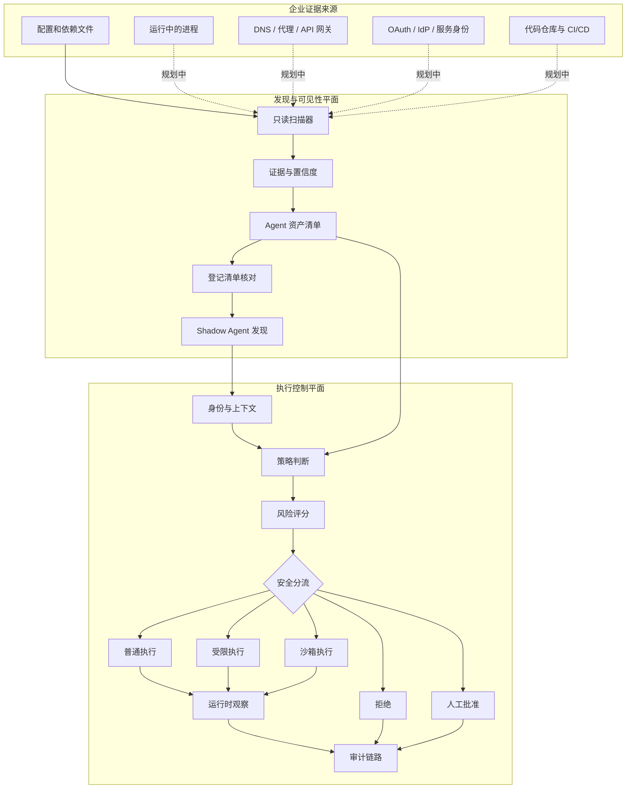

# Agent Governance Gateway

[English](README.md) | 简体中文

**发现、治理并观察 AI Agent 真正执行的行为。**

Agent Governance Gateway 是一个面向 AI Agent 的开源安全控制面。它将“发现未登记 Agent 的证据发现层”与“在动作执行前检查身份、委托权限、能力、资源敏感度和运行时行为的执行控制层”组合在一起。

项目坚持一个核心区分：

> **发现解决“Agent 是否存在”；执行控制解决“Agent 可以做什么”。**

当前仓库是可运行的 MVP 和参考架构，还不是生产级安全边界。策略路由器和第一阶段的配置型 Shadow Agent 扫描器已经实现；现在还增加了实验性的会话观察器，可以记录子进程生命周期和经过脱敏的 Agent JSONL 证据，但经公司授权的真实 Agent 端点试点还没有运行。实时网络、身份与端点传感器仍属于后续路线图。

## 为什么需要这个项目

当 Agent 可以调用工具、访问凭据、修改文件、查询数据库或连接外部系统时，只过滤 Prompt 已经不够。企业需要回答两个不同问题：

1. **环境里到底有哪些 Agent，包括从未报备的 Agent？**
2. **每个 Agent 被允许做什么，它的实际行为有没有超出授权？**

Agent Governance Gateway 通过两个协作平面回答这两个问题。

## 系统架构



实线表示已经实现的路径，虚线表示企业版路线图中的传感器。

## 当前能力矩阵

| 能力 | 状态 | 说明 |
|---|---:|---|
| 配置/依赖型 Shadow Agent 发现 | 已实现 | 对明确指定的目录进行只读扫描 |
| 证据、置信度、指纹和去重 | 已实现 | 按项目与 Agent 类型合并多条证据 |
| 与已登记 Agent 清单核对 | 已实现 | 区分已登记 Agent 与 Shadow Agent |
| 能力和 Token Scope 校验 | 已实现 | 未知身份、资源和权限默认拒绝 |
| 可解释的风险分流 | 已实现 | `allow`、`restrict`、`sandbox`、`deny`、`escalate` |
| 计划动作与实际动作对比 | 已实现 | 使用安全的模拟 executor 行为演示 |
| 追加式审计记录 | 已实现 | 本地 JSONL 持久化 |
| 会话级因果与跨工具序列检测 | 已实现 | 父事件、输入来源、累计风险；阻断“敏感读取 → 外发” |
| 间接 Prompt Injection 元数据规则 | 已实现 | 判断不可信检索来源与风险信号，不保存检索正文 |
| 受保护读取审计与隐私预算 | 已实现 | 记录 open/read 分类元数据、字节数和预算，不保存完整路径与内容 |
| 工具身份与 Schema 哈希校验 | 已实现 | 上报哈希与批准哈希不一致时默认拒绝 |
| 本地 Agent 会话观察器 | 实验性 | 记录子进程生命周期并规范化 JSONL 事件元数据，不保存命令和 Prompt 正文 |
| 实时进程发现 | 规划中 | 需要适配不同操作系统的进程传感器 |
| 网络/API 行为发现 | 规划中 | 需要出口代理、DNS、API 网关或服务网格遥测 |
| OAuth/NHI 发现 | 规划中 | 需要接入 IdP 和 OAuth 授权日志 |
| 真实沙箱隔离 | 规划中 | 当前 `sandbox` 是分流结果，不是 OS 级隔离 |
| 企业中央控制面 | 规划中 | 持久化资产清单、RBAC、多租户和策略分发 |

## 快速开始

需要 Go 1.26 或 Docker。

### 启动策略路由器

```bash
go run ./cmd/server
```

打开 [http://localhost:8080](http://localhost:8080)。控制台内置六个确定性场景：

| 场景 | 预期路由 | 验证的安全能力 |
|---|---|---|
| 正常代码请求 | `allow` | 身份、能力、Scope 和目标均合法 |
| 越权访问财务数据 | `deny` | 资源拒绝清单和委托权限不匹配 |
| 调试过程发生行为偏移 | `sandbox` | 计划外出现读取密钥和管理员工具调用 |
| 间接 Prompt Injection | `deny` | 不可信检索内容携带工具指令信号 |
| 受保护文件读取 | `sandbox` | 只保留读取分类元数据并扣减隐私预算 |
| 敏感读取后外发 | `deny` | 父事件和数据来源构成跨工具外泄序列 |

后三类规则只对经过 Router 或适配器上报的事件生效。当前项目尚不能独立看到绕过 Router 的所有文件和网络活动；公司端点上的全量观测仍需要 OS、EDR、代理或网关连接器。

使用 Docker：

```bash
docker compose up --build
```

### 发现一个未登记的 Agent 配置

仓库包含一个无害的 Shadow Agent 示例：

```bash
go run ./cmd/discover --path ./examples/shadow-agent-sample
```

预期结果：

```text
STATUS  RISK     CONFIDENCE  TYPE  NAME                                   EVIDENCE
shadow  high/85  95%         mcp   shadow-agent-sample / MCP integration  2

Total: 1  Registered: 0  Shadow: 1
```

自动化流程可以使用 JSON 输出：

```bash
go run ./cmd/discover --path ./examples/shadow-agent-sample --format json
```

发现签名与批准清单位于 [`configs/discovery.json`](configs/discovery.json)。扫描器会：

- 只读取通过 `--path` 明确指定的目录；
- 默认跳过 `.git`、依赖目录、构建产物和运行数据；
- 只保存证据元数据和相对路径，不保存文件内容；
- 限制候选文件大小；
- 使用稳定指纹合并多条证据；
- 将无法与批准清单匹配的结果标记为 `shadow`。

## 从“界面演示”走向真实行为证据

当前控制台能演示策略判断，但它还不能证明 Agent Governance Gateway 已经独立观察到一个真实 Agent。下一道发布门槛是在一台获准的公司端点上，使用公司批准的真实 Agent 完成受控试点：

```text
Agent Governance Gateway wrapper 启动批准的 CLI Agent
  → 将可用的结构化 Agent 日志规范化为“Agent 自报证据”
  → 用 OS 进程/文件和网络传感器提供独立证据
  → 把事件关联为同一条因果会话
  → 策略、偏移和审计页面解释最终结论
```

这条路径的第一部分已经由 `cmd/observe` 实现：它记录子进程 PID 和生命周期，在 Agent 提供 JSONL 时对事件分类，为原始载荷保存哈希，并且默认不保存命令、Prompt、工具参数和输出正文。普通 CLI Agent 即使没有 JSONL 也能留下 wrapper 生命周期证据，但无法获得工具语义；GUI、IDE、后台或绕过 wrapper 启动的 Agent 仍需要后续 OS/网络传感器。

低配置部署方案、授权边界、不同 Agent 的接入方式、确定性用例和通过标准见 [`docs/experiments/enterprise-agent-pilot.zh-CN.md`](docs/experiments/enterprise-agent-pilot.zh-CN.md)。试点顺序固定为：

```text
GitHub Private 仓库 → 获得公司批准 → 隔离的公司端点部署
→ 受控运行公司 Agent → 检查审计证据 → 修复缺口 → 重复验证
```

## 能不能发现事先不知道的 Shadow Agent？

**现在能发现一部分；完整发现需要部署对应的企业传感器。**

当前版本能在你明确扫描的目录中发现未登记的 Agent/MCP 配置和依赖。它无法凭空看见另一台机器上运行的 Agent，策略路由器也无法观察绕过自身的流量。

企业部署需要多个观察点：

| 观察点 | 可以发现什么 | 主要限制 |
|---|---|---|
| 源码/配置扫描器 | Agent 框架、MCP 配置和依赖 | 发现的是痕迹，不等于已经运行 |
| 端点进程传感器 | 正在运行的 Agent 框架和本地 MCP Server | 需要端点覆盖与操作系统权限 |
| 出口代理/DNS | LLM、工具和自动化服务的访问 | TLS 隐藏内容，自定义地址会降低判断置信度 |
| API 网关/服务网格 | 机器速度的工具/API 调用序列 | 只能看到经过托管网络路径的流量 |
| IdP/OAuth 日志 | 未批准授权、服务主体和委托 Token | 看不到本地离线 Agent |
| CI/CD 与云审计日志 | 定时或自治工作负载 | 需要连接器权限和跨来源关联 |

发现引擎应将多个弱信号关联成带来源和置信度的证据。一次发现不应自动等同于安全事件。资产清单还需要与企业批准清单核对：

```text
发现 → 收集证据 → 指纹/去重 → 登记核对 → 风险评分 → 纳入治理
```

被动传感器可以**发现**行为；要**阻止**行为，请求必须经过出口网关、API 网关、服务网格、端点控制或 Agent Governance Gateway 等执行点。一个完全离线、位于所有受监控端点之外的本地 Agent，无法只靠网络遥测可靠发现。

## 策略判断依据

路由器主要依据可验证的安全事实，而不是 Agent 声称的意图：

| 信号 | 示例 |
|---|---|
| 人类与 Agent 身份 | `coder-agent` 代表 `user-01` 行动 |
| 委托权限 | Token 有 `config.read`，没有 `finance.read` |
| 申请能力 | `read_config`、`generate_code`、`write_config` |
| 目标资源 | `public_workspace`、`finance_data`、`secrets_store` |
| 副作用与敏感度 | 只读动作与针对关键数据的 write/exec |
| 运行时行为 | 声明计划外出现 `read_secret` |
| 会话与因果 | `session_id`、`parent_event_id`、累计风险、剩余隐私预算 |
| 输入来源 | 来源类型、信任等级、内容哈希和风险信号，不保存正文 |
| 工具与数据流 | 工具/Schema 哈希、open/read 分类元数据、外部信任边界 |

策略位于 [`configs/policy.json`](configs/policy.json)。未知 Agent、未知资源、未授权能力和缺少 Scope 都会默认拒绝。

## API

发送一个可直接使用的请求：

```bash
curl -s http://localhost:8080/api/route \
  -H "Content-Type: application/json" \
  --data @requests/safe-code.json
```

接口列表：

- `GET /api/health` — 服务健康状态
- `GET /api/scenarios` — 内置路由演示场景
- `GET /api/discoveries` — 服务启动时加载的发现资产清单
- `GET /api/session-events?limit=30` — 规范化的本地 Agent 会话证据与明确的覆盖范围限制
- `POST /api/route` — 判断、分流、观察并审计请求
- `GET /api/audits?limit=20` — 最近审计记录

Discovery 原型目前通过本地 `cmd/discover` CLI 使用。传感器数据接入 API 和企业持久化资产清单属于下一阶段。

## 调研与产品映射

OWASP LLM 与 Agentic Top 10、NIST AI RMF、社区痛点、处置方案情报、开源项目借鉴、产品优先级和调研到发布的闭环，统一维护在一份双语文档中：[《调研与产品映射迭代》](docs/research-product-mapping-iteration.zh-CN.md)。

最近一次复核（2026-08-31）新增 MCP `2026-07-28` 协议/授权基线，以及 OpenAI–Hugging Face 和 UK AISI 两起 Agent 越界评测事件的主来源分析。相关建议目前为 `V1 plausible`：已进入安全边界、fixture 和产品优先级，但在完成 synthetic 复现前不会直接宣称控制已实现。

### Research to Product Skill

持续调研和本地产品迭代由独立的个人 Skill `$research-to-product` 驱动；本项目只是它的一个使用方。项目契约位于 [`.codex/research-to-product.json`](.codex/research-to-product.json)，其中声明中文工作源、英文同步文档、验证命令、框架版本和“禁止自动发布/部署/生产数据”的边界。

可直接对 Codex 说：`使用 $research-to-product 复核本周新证据，并只把通过验证门槛的内容落到项目。` Skill 可以在本地生成调研记录、fixture、实验、代码和文档变更，但 GitHub 推送、部署、公司设备实验和外部通信仍需要单独授权。

## 文档导航

每份说明文档都维护英文和简体中文两个版本。中文作为以后修改产品内容时的工作源版本；同一次改动中同步对应英文版。

| 主题 | 简体中文 | English |
|---|---|---|
| 项目说明 | [中文](docs/project-brief.zh-CN.md) | [English](docs/project-brief.md) |
| 企业 Agent 端点试点 | [中文](docs/experiments/enterprise-agent-pilot.zh-CN.md) | [English](docs/experiments/enterprise-agent-pilot.md) |
| 调研、框架映射、处置建议与迭代 | [中文](docs/research-product-mapping-iteration.zh-CN.md) | [English](docs/research-product-mapping-iteration.md) |
| 参与贡献 | [中文](CONTRIBUTING.zh-CN.md) | [English](CONTRIBUTING.md) |
| 安全策略 | [中文](SECURITY.zh-CN.md) | [English](SECURITY.md) |

## 仓库结构

```text
.
├── cmd/
│   ├── discover/           只读 Shadow Agent 发现 CLI
│   ├── observe/            实验性的本地会话观察器
│   └── server/             策略路由器与演示控制台
├── configs/
│   ├── discovery.json      发现签名和批准清单
│   └── policy.json         能力和资源策略
├── docs/                   产品设计与调研记录
├── examples/               路由场景和 Shadow Agent 示例
├── internal/
│   ├── audit/              JSONL 审计存储
│   ├── detection/          会话因果、来源、隐私预算和跨工具序列规则
│   ├── discovery/          证据、资产清单、核对和风险评分
│   ├── observer/           运行时计划偏移比较
│   ├── policy/             能力和 Scope 校验
│   ├── risk/               可解释路由风险
│   ├── router/             端到端决策编排
│   └── sessionaudit/       隐私优先的会话事件规范化
└── web/                    内嵌演示控制台
```

## 开发与验证

```bash
go test ./...
go test -race ./...
go vet ./...
go build ./cmd/server
go build ./cmd/discover
go build ./cmd/observe
```

## 安全边界

当前仓库是 MVP 和参考实现：

- Discovery 是被动、本地、明确限定范围的配置型扫描；
- 发现签名属于启发式证据，可能误报，也可能漏掉自定义 Agent；
- 策略路由器只能保护经过它的请求；
- executor 通过 `simulated_actions` 模拟，不会执行真实宿主机命令；
- `sandbox-executor` 是路由决定，不是 Docker、gVisor 或 Firecracker 隔离；
- 审计日志只是追加式文件，还不具备防篡改和中央持久化能力；
- 会话观察器中的 JSONL 属于 Agent 自报信息；当前只有 wrapper 生命周期由 Agent Governance Gateway 独立记录。公司试点必须获得明确授权并限定数据边界；
- 身份认证、签名 Agent 身份、多租户、持久化资产清单、策略分发和企业传感器尚未实现。

在缺少独立安全评审前，不要让此 MVP 直接接触生产凭据，也不要在没有其他证据佐证时将一次发现直接判定为安全事件。

## 路线图

### 发现与可见性

- [x] 限定范围的配置与依赖扫描器
- [x] 证据、置信度、指纹、登记清单核对
- [ ] 跨平台进程扫描器
- [ ] GitHub Organization 与 CI/CD 扫描器
- [ ] 网络/API/LLM 出口遥测接入
- [ ] OAuth、服务主体和非人类身份核对
- [ ] 带负责人和生命周期状态的持久化资产清单

### 执行控制与运行时

- [x] 确定性策略与风险分流
- [x] 计划动作与实际动作对比
- [x] 实验性子进程与 JSONL 会话观察器
- [x] 输入来源、工具身份/Schema、父事件和因果会话字段
- [x] 敏感读取 → 外发与污染输入 → 副作用工具的序列策略
- [x] 会话累计风险和受保护读取隐私预算
- [ ] 完成获准的企业 Agent 端点试点，生成脱敏 golden evidence 并测量资源开销
- [ ] 用独立 OS 证据佐证进程树与文件活动
- [ ] 将当前进程内因果状态持久化，并增加可交互因果图
- [ ] 真实 MCP/HTTP 反向代理
- [ ] 接入真实 Docker 沙箱的 Executor Adapter
- [ ] 一次性能力授权与人工批准
- [ ] OPA/OpenFGA 适配和策略分发
- [ ] 防篡改审计链与 OpenTelemetry 输出
- [ ] 将已实现的 Schema 哈希比较接入签名工具注册表和真实 MCP Gateway

项目采用明确的“调研到发布”闭环：收集证据、映射框架、评估处置办法、定义验收实验、实现最小控制、检查获准端点证据，只有通过门槛才发布。流程见[《调研与产品映射迭代》](docs/research-product-mapping-iteration.zh-CN.md)。

## 参与贡献与安全报告

开发流程见 [CONTRIBUTING.zh-CN.md](CONTRIBUTING.zh-CN.md)。怀疑存在安全漏洞时请按照 [SECURITY.zh-CN.md](SECURITY.zh-CN.md) 私下报告，不要直接创建公开 Issue。

## 许可证

[MIT](LICENSE)
