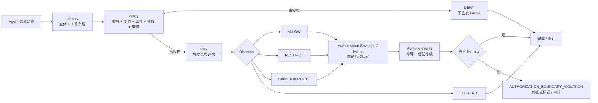

# Aegis Router

[English](README.md) | 简体中文

**A Policy-Driven Security Router for AI Agents**
**面向 AI Agent 的策略驱动安全路由器**

Aegis Router 是位于 AI Agent 与其工具/资源之间的零信任安全控制面。每次动作执行前，它根据**主体身份、Agent 工作负载身份、委托权限、能力、工具、资源、操作和约束**作出策略决定；对可执行请求签发明确的 `AuthorizationEnvelope`（Execution Permit，执行许可），再将运行时事件与该许可逐项核对并保留可解释审计链。API 中的字段名为 `authorization_envelope`，许可标识为 `permit_id`。

> **批准一个 Agent 存在，不等于批准它的行为。** 资产登记回答“这个工作负载能否进入受治理环境”；逐次授权回答“它此刻能否凭这份委托，用这个工具，对这个资源执行这个操作”。

GitHub 仓库仍保留 [`szey/agent-governance-gateway`](https://github.com/szey/agent-governance-gateway) 名称与链接以避免迁移，产品名称统一为 **Aegis Router**。

当前代码是可运行的 MVP 和参考实现，不是生产安全边界。它可演示并测试确定性的逐次授权、风险分流、执行许可、适配器事件接收、越界判定和审计。它没有通用端点传感器，也不会自动拦截绕过 Aegis Router 的 Agent；`SANDBOX` 目前只是路由结果，未连接真实隔离后端。

## 产品中心

Aegis Router 优先解决运行时控制，而不是把文件扫描当作主产品：

| 平面 | 目标权重 | 回答的问题 |
|---|---:|---|
| Runtime Gateway / Enforcement | 约 60% | 这次动作是否获得授权，应当如何分流？ |
| Runtime Observation + Audit | 约 25% | 实际事件是否仍在执行许可内，证据可靠吗？ |
| Agent Inventory / Discovery | 约 15% | 环境中存在哪些已登记工作负载或待核实线索？ |

Discovery 是可选的资产可见性模块。配置、依赖、marketplace、cache 或 manifest 只能构成发现证据，不能单独证明 Agent 正在运行，更不能生成某次动作的“运行时风险”。

## 一次动作的安全闭环



保留的调查顺序是 `I → P → R → D → O → A`：

- **Identity**：谁在行动，哪个 Agent/工作负载代表它行动；
- **Policy**：委托 Scope、能力、工具、资源、操作和明确约束是否匹配；
- **Risk**：对已经通过授权门槛的动作评估敏感度与不确定性；
- **Dispatch**：`ALLOW / RESTRICT / SANDBOX / DENY / ESCALATE`；
- **Observation**：适配器或传感器事件是否超出执行许可；
- **Audit**：请求、决定、许可、证据、违规和最终结论的因果链。

风险评分不能推翻明确的授权失败。例如，未获得 `finance.read` 的请求必须由 Policy 拒绝，而不是靠一个较低风险分数放行。

## 安全上下文与执行许可

每个 `ActionRequest` 表示一次尝试动作的安全上下文：

```text
PrincipalContext       human/service 主体、租户或环境
AgentIdentity          agent_id、workload_id、owner、environment、framework/version
DelegatedAuthority     credential fingerprint、issuer、subject、scopes、expiry
ToolContext            tool_id/name、provider、schema hash
ActionRequest          capability、operation、resource、side effect、destination
```

系统绝不需要保存或审计原始 Bearer Token。`claimed_intent` 可以作为上下文或风险信号，但不是授权依据。授权主要来自：

```text
identity + delegated authority + capability + tool + resource + operation + constraints
```

`ALLOW`、`RESTRICT` 或 `SANDBOX` 请求会得到有时效且绑定请求/主体/Agent 的 Permit；`DENY` 和 `ESCALATE` 不会获得可执行许可。许可描述 Aegis 实际批准的边界，例如：

```json
{
  "allowed_capability": "config.read",
  "allowed_tool": "config-reader",
  "allowed_resource": "protected_config",
  "allowed_operations": ["read"],
  "constraints": {
    "network_egress": "deny",
    "secret_access": "deny",
    "write_access": "deny"
  }
}
```

Agent 声称的计划可以显示为调查上下文，但 `declared plan != authorization boundary`；真正的安全边界是签发的执行许可。

## 当前能力与证据真相

| 能力 | 当前状态 | 能证明什么 / 不能证明什么 |
|---|---:|---|
| 结构化动作授权 | MVP 已实现 | 对进入 API 的请求校验身份、委托、能力、工具、资源、操作和约束 |
| 显式执行许可 | MVP 已实现 | 记录本次获准范围；拒绝/升级请求无许可 |
| Policy 与 Risk 分离 | MVP 已实现 | 未授权先拒绝；风险只影响已授权动作的分流 |
| Runtime Event 接收与许可核对 | MVP 已实现 | 评估由适配器提交、且绑定 Permit 的事件；Demo 事件由服务端夹具生成 |
| 逐次审计与因果链 | MVP 已实现 | 记录进入控制点的请求、决定、风险、许可、证据来源和最终结论 |
| Demo Lab 服务端夹具运行器 | 演示/回归 | 将无害的固定事件送入同一许可核对流程，并明确标记为 `simulated_demo`；它不是真实执行器或生产遥测 |
| 本地 CLI wrapper | 实验性 | 可独立记录其启动的子进程生命周期；Agent JSONL 仍是自报证据 |
| Agent Inventory / 配置发现 | 可选、已实现 | 查找限定目录内的配置/依赖线索并与本地登记表核对 |
| OS 文件/进程全量传感器 | 未连接 | 不能独立看到任意进程或文件访问 |
| 网络传感器 | 未连接 | 不能独立看到绕过 Router/Adapter 的外联 |
| 真实沙箱隔离 | 未连接 | `SANDBOX` 是路由意图，不代表 Docker/gVisor/Firecracker 隔离 |
| 企业认证、RBAC、多租户、中央策略分发 | 未实现 | 管理控制台只适合可信本机开发/演示 |

运行时事件必须显示证据来源和信任等级：

| `source` | `trust_level` | 含义 |
|---|---|---|
| `gateway_enforced` | `enforced` | 请求经过 Aegis 控制点 |
| `instrumented_adapter` | `adapter_reported` | 调用方声明来自适配器；MVP 尚未认证 Adapter 身份 |
| `agent_self_reported` | `self_reported` | Agent 或其日志自报 |
| `os_sensor` / `network_sensor` | `independent_sensor` | 仅在对应传感器实际接入后使用 |
| `simulated_demo` | `simulated` | Demo Lab 的合成事件 |

未知覆盖必须保持 `UNKNOWN / not instrumented`，不能显示成“0 个缺口”。

当前 Event API 会校验来源/信任标签配对和 Permit 绑定，但尚无 Adapter 身份认证、加密完整性或防重放；因此标签表达证据声明，不等于独立证明。

## 快速开始

需要 Go 1.26；只有修改 TypeScript 前端时才需要 Node.js。

```bash
go run ./cmd/server
```

打开 [http://localhost:8080](http://localhost:8080)。也可以使用：

```bash
docker compose up --build
```

控制台以运行时信息为主：Overview、Decisions、Audit / Investigations、Policies、Agent Inventory 和 Demo Lab。首页不会展开大量 marketplace/cache 证据。

### API 方向

新的主流程拆开“执行前授权”和“执行中证据”：

```text
POST /api/authorize
  → policy decision + risk assessment + dispatch decision
  → AuthorizationEnvelope / Permit（仅在可执行结果时）

POST /api/runtime-events
  → 绑定 request/permit 的事件
  → permit 边界检查与违规判定

POST /api/executions/{id}/complete
  → 形成最终结论
```

读取接口：

- `GET /api/decisions` — 最近逐次授权决定；
- `GET /api/audits` — 调查和审计链；
- `GET /api/runtime-coverage` — 每类遥测的真实覆盖状态；
- `GET /api/agents` — Agent 资产登记；
- `GET /api/scenarios` — Demo Lab 场景；
- `GET /api/discoveries` — 可选发现证据。

其他当前接口包括 `GET /api/health`、`GET /api/overview`、`GET /api/policies`、`POST /api/demo-lab/{id}/run` 及本地 Inventory 管理接口。`POST /api/route` 作为 `/api/authorize` 的兼容别名保留，但不会把客户端随请求提交的模拟动作当成独立观察结果。`POST /api/runtime-events` 只接受 `instrumented_adapter` 或 `agent_self_reported`；更强来源由受信任的内部集成保留。请以实际运行代码和 API 返回为准；MVP 接口仍可能演进。

## Demo Lab

六个场景都是确定性安全回归，不是生产事件：

| 场景 | 核心结果 | 验证目标 |
|---|---|---|
| Safe code request | `ALLOW` + Permit | 合法身份、委托、工具、资源和操作；Demo 事件保持在许可内 |
| Unauthorized finance access | `DENY`、无 Permit | code Scope 不能访问 finance；executor 不应被调用 |
| Authorization-boundary violation | Permit 后违规 | 只允许 `config.read`；`secret.read` 或写入事件触发越界结论 |
| Indirect prompt injection | `DENY/ESCALATE` | 不可信来源与副作用工具的确定性组合规则 |
| Protected file read | 受限/沙箱路由 | 只记录分类元数据和预算，不记录正文或完整路径 |
| Sensitive read followed by egress | `DENY` 或运行时违规 | 跨工具因果链和拒绝外联约束 |

Demo Lab 的事件来源必须标记为 `simulated_demo`。只有适配器、网关或真实传感器生成的事件才可以使用相应的非演示来源标签。

## Agent Inventory（可选）

Discovery 默认关闭。只有需要 Inventory 时才使用可重复的 `--discovery-root` 指定一个或多个获准目录；未传入时，运行时首页不会加载仓库 Shadow 示例：

```powershell
.\dist\agent-governance-gateway.exe `
  --addr "127.0.0.1:8080" `
  --discovery-root "C:\允许扫描的Agent目录" `
  --discovery-root "D:\另一个获准目录"
```

也可以单独运行只读扫描：

```bash
go run ./cmd/discover --path ./examples/shadow-agent-sample
```

发现模块：

- 只读取明确指定的目录，遇到无权限子目录时记录 coverage gap 并继续；
- 保存相对证据路径、类型、指纹与置信度，不保存文件内容；
- 将 marketplace/catalog/cache/temp 线索归入 `Discovery Evidence / Available Integrations`；
- 区分 `available`、`installed`、`configured` 和 `observed`；
- 仅把有部署证据但无法与登记表匹配的工作负载称为 Shadow；
- 不把依赖字符串或 MCP manifest 本身当作独立 Agent 身份；
- 将“发现置信度/部署状态”与“某次动作的运行时风险”分开。

本地资产登记可记录 `agent_id`、`workload_identity`、显示名、Owner、环境、框架、批准引用、到期日、状态和 `policy_profile`。登记不授予行为权限；每次进入 Aegis Router 的动作仍要独立授权和审计。

## 隐私默认值

正常 UI 和运行时审计不应展示原始 Windows 用户名或完整本地路径。资源应归一化为 `USER_PROFILE / AGENT_CONFIG`、`WORKSPACE / SOURCE`、`PROTECTED_CONFIG`、`SECRET_STORE` 等类别。Inventory 若需要相对证据路径，应与运行时审计明确分区。

永不记录：原始 Token、秘密值、检索文档正文；除非用户明确进入本地 Demo 模式，也不记录 Prompt 正文。管理数据与审计均留在操作者批准的数据边界内。

## 文档与试点

中文是语义工作源，英文在同一次变更中同步：

| 主题 | 简体中文 | English |
|---|---|---|
| 产品说明 | [中文](docs/project-brief.zh-CN.md) | [English](docs/project-brief.md) |
| 企业端点试点 | [中文](docs/experiments/enterprise-agent-pilot.zh-CN.md) | [English](docs/experiments/enterprise-agent-pilot.md) |
| 调研、风险框架与产品迭代 | [中文](docs/research-product-mapping-iteration.zh-CN.md) | [English](docs/research-product-mapping-iteration.md) |
| 参与贡献 | [中文](CONTRIBUTING.zh-CN.md) | [English](CONTRIBUTING.md) |
| 安全策略 | [中文](SECURITY.zh-CN.md) | [English](SECURITY.md) |

公司试点不是“安装后自动监控”。只有经过 Router 的动作或由已接入 Adapter/Sensor 提交的事件才可被评估；正式试点必须重新获得书面授权，并使用 synthetic 数据。详见[企业 Agent 端点试点](docs/experiments/enterprise-agent-pilot.zh-CN.md)。

持续调研使用独立的 `$research-to-product` Skill；本项目只是该 Skill 的一个使用方。项目契约位于 [`.codex/research-to-product.json`](.codex/research-to-product.json)，且禁止自动发布、部署和使用生产数据。

## 开发与验证

```bash
npm install
npm run check:web
npm run build:web
go test ./...
go test -race ./...
go vet ./...
```

前端源文件位于 `web/src/app.ts`，编译后的 `web/static/app.js` 一并提交，因此只运行仓库二进制的低配置电脑不需要 Node.js。

## 路线图

### Runtime Gateway / Enforcement

- [x] 默认拒绝的确定性策略与 Policy/Risk 分离
- [x] 显式 Agent、委托、工具、资源与操作上下文
- [x] `AuthorizationEnvelope` / Permit 与逐次授权审计
- [x] Runtime Event 接收与许可边界核对
- [ ] 真实 MCP/HTTP/工具代理接入点
- [ ] 人工批准、Permit 撤销与一次性授权
- [ ] 签名身份、企业认证、RBAC 与策略分发

### Observation / Audit

- [x] 带来源/信任标签的 Demo/Adapter 事件
- [x] 许可内事件与越界事件的确定性判定
- [x] 会话、父事件、输入来源和跨工具序列元数据
- [ ] 独立 OS 与网络传感器
- [ ] 防篡改审计链、持久化因果状态和 OpenTelemetry
- [ ] 真实隔离 Executor 与可验证终止语义

### Inventory / Discovery

- [x] 限定目录扫描、指纹、去重和本地登记核对
- [x] 可用集成与已部署工作负载分离
- [ ] 进程、IdP/OAuth、CI/CD 和云审计连接器
- [ ] 企业中央资产清单与完整生命周期

## 安全边界

- Aegis Router 只能授权和审计进入其控制点的请求；
- Adapter 或 Agent 自报事件可能不完整，必须保留来源标签；
- 未接入的传感器状态是未知，不是零风险或零缺口；
- `SANDBOX` 路由不是宿主机隔离，除非明确连接并验证隔离后端；
- Discovery 线索可能误报或漏报，不能证明已经运行；
- 本地 JSONL 审计尚不防篡改，也不是企业中央存储；
- 管理端点的专用 Header 不是认证或 RBAC；
- 在独立安全评审前，不要连接生产凭据、客户数据或不受控外网。

## 许可证

[MIT](LICENSE)
