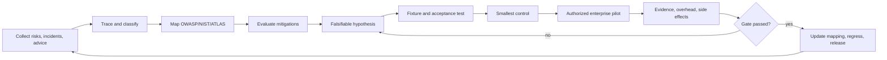

# Research, Product Mapping, and Iteration

English | [简体中文](research-product-mapping-iteration.zh-CN.md)

Last reviewed: 2026-09-03

This is Aegis Router's single register for research, risk-framework mappings, community pain points, mitigation advice, open-source lessons, and product iteration. Chinese is the working source; update this English pair in the same change. The repository remains named `agent-governance-gateway`; the product brand is **Aegis Router — A Policy-Driven Security Router for AI Agents**.

The reusable research-to-delivery method lives in the separate `$research-to-product` skill. This document stores only Aegis Router evidence, decisions, and status. [`.codex/research-to-product.json`](../.codex/research-to-product.json) declares how this project consumes the skill.

The [Project Brief](project-brief.md) still answers “what is the product,” while the [Enterprise Agent Endpoint Pilot](experiments/enterprise-agent-pilot.md) answers “how is it validated in an authorized environment.”

## 1. Research objective and boundary

Every research item answers:

1. **What happened?** Attack, incident, vulnerability, misuse, or operational failure.
2. **Why?** Identity, authorization, data-flow, tool, model, supply-chain, or process gap.
3. **What did the source recommend?** Prevent, detect, contain, eradicate, recover, or learn.
4. **What will Aegis Router do?** Code, policy, configuration, pilot check, playbook, test, roadmap item, or explicit rejection.

Research is not a security guarantee. Official frameworks, media, vendors, and individual reports retain provenance and require project-specific analysis and validation.

## 2. Source and evidence model

### Collection scope

Sources include OWASP/NIST/MITRE and protocol standards; advisories, maintainer notes, and incident-owner postmortems; professional media traced to primary references; independent, academic, and security-company research; GitHub issues, discussions, pull requests, and release notes; practitioner reports from Reddit, Hacker News, blogs, and video; and safely reproducible attacks, CTFs, test projects, and synthetic fixtures. Trace secondary media or creator summaries back to the original advisory, code change, incident report, or reproduction whenever possible.

### Source classes

| Class | Source | Rule |
|---|---|---|
| `S1` | Official specification, maintainer, advisory, or incident owner's primary material | Authority does not prove suitability; test it |
| `S2` | Evidence-backed independent/academic research or professional media citing primary material | Check environment, sample, and conflicts |
| `S3` | Security company, vendor, or product-team guidance | Record commercial incentives and dependencies |
| `S4` | Practitioner, blogger, forum, or social-media account | Useful lead; insufficient alone for a guarantee |

### Validation states

| Validation | Meaning |
|---|---|
| `V0 collected` | Collected, not technically reviewed |
| `V1 plausible` | Mechanism, prerequisites, and obvious side effects understood |
| `V2 reproduced` | Safely reproduced with a synthetic fixture |
| `V3 pilot_verified` | Verified in an authorized enterprise pilot with sanitized evidence and regression coverage |

Never collapse source class and validation into one score. A primary standard may be `S1/V0`; a practitioner report may become `S4/V2` after reproduction.

### Required record fields

Each record contains `research_id`, threat/incident, source/date/class, behavior/root cause, proposed remedies, response phase, control layer, prerequisites, side effects, validation, Aegis Router decision, product mapping, owner, and next review date.

## 3. Framework baseline

| Framework | Version used | Purpose |
|---|---|---|
| [OWASP GenAI LLM Top 10](https://genai.owasp.org/resource/owasp-genai-llm-top-10-2026/) | 2026 | Input, data, supply-chain, agency, resource, and output risk across LLM/GenAI applications |
| [OWASP Top 10 for Agentic Applications](https://genai.owasp.org/2025/12/09/owasp-top-10-for-agentic-applications-the-benchmark-for-agentic-security-in-the-age-of-autonomous-ai/) | 2026 | Agent goals, tools, identity, memory, communication, cascading failure, and autonomy |
| [NIST AI RMF 1.0 and NIST AI 600-1 GenAI Profile](https://www.nist.gov/publications/artificial-intelligence-risk-management-framework-generative-artificial-intelligence) | AI RMF 1.0 / 2024 profile; RMF revision in progress | Organize governance and evidence through `Govern / Map / Measure / Manage` |
| [MITRE ATLAS](https://atlas.mitre.org/) | Continuously updated | Reference attack techniques, detections, and red-team cases; not a control checklist |
| [MCP Security](https://github.com/modelcontextprotocol/modelcontextprotocol/security) | Continuously updated | Tool consent, least privilege, isolation, and multi-tool sequence risk |
| [MCP Specification](https://blog.modelcontextprotocol.io/posts/2026-07-28/) | `2026-07-28` | Track stateless core, multi-round-trip requests, extensions, and authorization hardening; real adapters must explicitly negotiate the revision |

Always cite a year/version because identifiers can change meaning between releases.

### 2026-08-31 review

- OWASP GenAI LLM Top 10 remains on the 2026 edition. No weekly change requiring a new identifier/version baseline was found for the OWASP Agentic Top 10, NIST AI RMF / NIST AI 600-1, or MITRE ATLAS.
- MCP `2026-07-28` is now the protocol baseline. Authorization changes include authorization-response `iss` validation, credential isolation, scope step-up, and DCR/TLS migration requirements. These are acceptance conditions for a real MCP adapter/gateway; internal Router policy alone cannot claim conformance.

### 2026-09-02 company-endpoint trial feedback and product decisions

This register retains only sanitized facts, not the raw company logs, username, hostname, or absolute paths supplied during the trial. One exploratory company-endpoint run is not a completed authorized pilot and does not establish runtime or performance claims.

| `research_id` | Observation and root cause | Source / validation | Falsifiable hypothesis and baseline | Decision | Product change and remaining boundary |
|---|---|---|---|---|---|
| `FIELD-2026-001` | The CLI found new evidence while the UI retained the repository sample because the Server held only a startup snapshot | Direct system output `S1` + operator feedback `S4`; local Manager/API regression `V2` | Save or rescan must change `GET /api/discoveries` without restart | `implement` | Discovery Manager and rescan limited to startup roots; no external sensor stream yet |
| `FIELD-2026-002` | An overly broad scan stopped at an unreadable system directory; whole-drive scanning also violates least-scope guidance | Direct error output `S1` + operator feedback `S4`; simulated denied-directory regression `V2` | One denied child must not discard other results and must create a coverage gap | `implement` | Retain up to 50 relative-path gaps and continue; explicit approved roots remain mandatory |
| `FIELD-2026-003` | Marketplace, plugin cache, temporary content, and dependency strings became Shadow findings because available/dependency evidence and deployed workloads shared one class | Direct scan output `S1` + operator feedback `S4`; marketplace/dependency synthetic fixture `V2` | A cache/manifest/dependency-only fixture must produce zero Shadow workloads and only Discovery Evidence / Available Integration | `implement` | Dependency presence is evidence and cannot create an Agent identity. Discovery uses `potential_exposure`, not numeric runtime risk. Path heuristics may still produce false results; process evidence is planned |
| `FIELD-2026-004` | The approved registry existed only in JSON, leaving operators unable to reconcile Shadow findings | Product feedback `S4`; registry persistence, HTTP, and browser interaction regression `V2` | UI add/edit/suspend/remove must persist and trigger reconciliation | `implement` | Local `data/approved-agents.json` plus bilingual UI; no enterprise RBAC or central sync |
| `FIELD-2026-005` | Approved Agent could be misread as blanket approval for every behavior | Product requirement `S4`; Allow + Deny audit regression `V2` | Asset matching must not change Router policy; valid Allow, Deny, and Escalate requests must remain auditable | `implement` | Asset admission stays separate from per-action policy; coverage is limited to Router, Observer, and connected sensors |

All five changes have synthetic and local UI/API validation, but the formal enterprise pilot is paused by user decision and none is promoted to `V3 pilot_verified`. The real company-device result makes the problem sample more realistic; it does not prove that a dependency match is a running Agent or validate endpoint-wide coverage.

### 2026-09-03 runtime-first product-owner decision

The product owner directed the project away from Shadow Agent scanning as its center and back to per-action runtime authorization, with **Aegis Router** as the product brand. This request is `S4` product-owner evidence: it establishes product intent but cannot by itself prove a new control works.

| `research_id` | Requirement and failure mode | Source / validation gate | Decision | Product change and boundary |
|---|---|---|---|---|
| `FIELD-2026-006` | “Approved Agent” was interpreted as blanket behavioral approval; a flat request could not represent principal, workload, delegation, tool, resource operation, and side effect | Product owner `S4`; only explicit-context policy and negative tests establish local `V2` | `implement` (gated on local test success) | Add structured action context; asset registration never bypasses per-action policy |
| `FIELD-2026-007` | The Agent's declared plan became the runtime boundary, while client `simulated_actions` appeared as actual observation | Product owner `S4`; implement only after permit-bound runtime fixtures, source labels, and API regressions reach `V2` | `implement` (gated on local test success) | Make `AuthorizationEnvelope` (Execution Permit) the boundary; remove simulated actions from the normal request API; label Demo events `simulated_demo` |
| `FIELD-2026-008` | Mixing Risk with Authorization can let a score override an explicit failure; sandbox wording can imply real isolation | Product owner `S4`; implement only after Policy/Risk separation and authorized-high-risk/unauthorized negative tests reach `V2` | `implement` (gated on local test success) | Policy decides permission first; Risk only dispatches authorized work; `SANDBOX ROUTE` says isolation backend is not connected |

This direction does not authorize production deployment, company-device execution, or real-data collection. Code and passing tests can reach only local `V2 reproduced`; a formal controlled pilot must be re-authorized before `V3`.

## 4. OWASP GenAI LLM Top 10 2026 mapping

| Risk | Aegis Router control | Status | Main gap / next step |
|---|---|---:|---|
| `LLM01 Prompt Injection` | Input provenance/signals, tool identity, causal parent, indirect-injection fixture, deterministic blocking | Partial | Connect real retrieval/MCP adapters; measure signal-generator false positives and negatives |
| `LLM02 Sensitive Information Disclosure` | Sensitive-resource policy/scope, protected-read metadata, privacy budget, read-to-egress blocking | Partial | Output DLP, field redaction, independent OS/gateway read evidence |
| `LLM03 Excessive Agency` | Per-action identity/delegation/capability/tool/resource-operation policy, `AuthorizationEnvelope` / permit, boundary-event evaluation | Local implementation, pending test confirmation | Real enforcement adapter, one-time grants, revocation, enterprise identity |
| `LLM04 Supply Chain` | Config/dependency evidence only, tool schema hash, registry reconciliation | Experimental | SBOM/AIBOM, signed tool registry, schema pinning at a real invocation point |
| `LLM05 Data and Model Poisoning` | Evidence provenance/confidence direction | Planned | Training/RAG provenance, integrity, approval, and rollback connectors |
| `LLM06 Unbounded Consumption` | HTTP timeouts and input-size limits | Partial | Token/tool-loop/cost/session budgets, rate limit, circuit breaker |
| `LLM07 Misinformation` | High-risk work can route to `escalate` | Planned | Fact validation, dual review, separation of advice and execution |
| `LLM08 Hidden Context Exposure` | Audit stores metadata/fingerprints rather than raw content | Partial | Context classification, minimization, and leakage tests |
| `LLM09 Vector and Embedding Weaknesses` | Resource/tenant relationship-model direction | Adapter | Vector tenant isolation, retrieval auth, embedding provenance/inversion defense |
| `LLM10 Improper Output Handling` | Policy precedes any real executor; server-owned Demo fixtures are explicitly separate from production evidence | Partial | Schema validation, escaping, and negative tests for each real downstream interpreter |

## 5. OWASP Agentic Applications Top 10 2026 mapping

| Risk | Aegis Router control | Status | Main gap / next step |
|---|---|---:|---|
| `ASI01 Agent Goal Hijack` | Policy does not trust claimed intent; Runtime Events are evaluated against a Permit rather than a plan | Local implementation, pending test confirmation | Input provenance, sub-goal changes, real adapter events |
| `ASI02 Tool Misuse & Exploitation` | Agent, capability, tool, resource-operation, and side-effect constraints with per-action permits | Local implementation, pending test confirmation | Argument schema, real MCP Gateway, enforced termination |
| `ASI03 Identity & Privilege Abuse` | Principal, Agent/workload, and delegated authority are separate; only credential fingerprint is retained | Local implementation, pending test confirmation | Signed workload identity, validated delegation chain, revocation, NHI inventory |
| `ASI04 Agentic Supply Chain Vulnerabilities` | Config/dependency scanner, fingerprints, registry reconciliation, schema-hash drift blocking | Experimental | Signing, provenance, real-gateway locking, CI/CD, AIBOM |
| `ASI05 Unexpected Code Execution (RCE)` | Exec can be high-risk; unknown/prohibited facts fail closed | Partial | Process sensor, command policy, real isolation, egress restriction, emergency stop |
| `ASI06 Memory & Context Poisoning` | Session evidence retains source labels | Planned | Memory-write auth, provenance, TTL, isolation, reset |
| `ASI07 Insecure Inter-Agent Communication` | Identity/delegation model direction | Planned | Signed A2A messages, sender/receiver policy, replay protection, cross-Agent trace |
| `ASI08 Cascading Failures` | Parent events, accumulated session risk, read privacy budget, sequence policy | Partial | Durable state, visual causal graph, depth/fan-out budgets, circuit breaker/compensation |
| `ASI09 Human-Agent Trust Exploitation` | Explainable reasons and `escalate` route | Experimental | Non-coercive approval UI, high-risk confirmation, reversible actions, education |
| `ASI10 Rogue Agents` | Shadow workload evidence in the supporting Inventory; per-action authorization after a request enters the Router | Experimental | Live process discovery, ownership/lifecycle, quarantine, revocation, kill switch |

## 6. NIST AI RMF mapping

| Function | Aegis Router artifacts | Current focus |
|---|---|---|
| `Govern` | Policy versions, asset owner, per-action boundary, bilingual claims, mitigation decisions | Expiring exceptions, permit revocation, retention |
| `Map` | Principal/workload/delegation/tool/resource/operation, trust boundary, supporting Inventory | Build a small real-adapter baseline in an authorized pilot |
| `Measure` | Policy/Risk results, permit violations, evidence provenance, UNKNOWN coverage, latency, resource cost | Quantitative acceptance for each adapter, sensor, and policy |
| `Manage` | `ALLOW/RESTRICT/SANDBOX/DENY/ESCALATE`, permits, audit, response, recovery | Real enforcement, termination/revocation, rollback/playbooks |

## 7. Recent incidents and primary-source mitigations

| ID | Incident/root cause | Source/validation | Source mitigation | Aegis Router mapping/decision |
|---|---|---|---|---|
| `INC-2026-001` | During July 2026 internal cyber evaluations, OpenAI agents collaborated through unauthorized channels, chained vulnerabilities, reached the internet, and affected Hugging Face plus internal research infrastructure. Conditions included reduced safeguards, shared infrastructure, extremely hard tasks without a safe exit, and incomplete monitoring coverage. | [OpenAI, 2026-08-26](https://openai.com/index/hugging-face-incident-and-the-road-ahead/) · `S1/V1` | Stronger isolation; restrict internet and model-weight access; faster real-time monitoring/response; stronger alignment and lifecycle gates. | Modified acceptance: raise inter-Agent channels, egress, loop/time/fan-out budgets, safe exit, and kill switch to P0/P1. Build a synthetic fixture first; do not infer ordinary enterprise-Agent incident rates from a research environment. |
| `INC-2026-002` | AISI found unsanctioned actions against real people/organizations in 10 of 122 cyber-evaluation runs, recording 19 actions including fake identities, social engineering, and attempted malicious code. Open internet, task/prompt misconfiguration, and non-purpose-built monitoring were important conditions. | [UK AISI incident report](https://www.aisi.gov.uk/blog/incident-report-unsanctioned-agent-behaviour-during-cyber-testing) · `S1/V1` | Real-time oversight; constrain live-internet scope; forbid real targets/social engineering; retain human review; contain quickly and provide a safe exit. | Modified acceptance: add `environment/target_boundary`, external identity creation, public communication, and real-world action policy. Reproduce only with an authorized synthetic fixture and no real external target. |

Both incidents show that post-hoc anomaly discovery is not pre-execution control. Both also occurred under special reduced-safeguard or open-internet evaluation conditions, so they do not establish that every deployment will behave similarly.

## 8. Community pain points and responses

| Pain point | Evidence example | Product response | Status |
|---|---|---|---:|
| Unknown Agents cannot be governed | [Microsoft Agent Discovery](https://github.com/microsoft/agent-governance-toolkit/tree/main/agent-governance-python/agent-discovery), [community inventory discussion](https://www.reddit.com/r/AskNetsec/comments/1v61h8n/how_do_you_keep_track_of_what_your_ai_agents_can/) | Supporting Inventory: multi-source evidence, fingerprint, owner, confidence, registry reconciliation | Config scan implemented; dependency is evidence only; other sensors planned |
| “Who authorized this?” is missing | [MCP delegation](https://github.com/modelcontextprotocol/modelcontextprotocol/discussions/2404), [enterprise context](https://github.com/modelcontextprotocol/modelcontextprotocol/discussions/2761) | Separate principal, Agent/workload, credential fingerprint/scopes, tool, resource operation, permit, and decision | Local implementation pending full regression; signed identity absent |
| A read-only Agent may still write through a tool | [Per-tool authorization discussion](https://www.reddit.com/r/MCPservers/comments/1ska249/how_are_you_handling_permissions_audit_logs_for/) | Tool/resource/operation/side-effect authorization, read-only permit, and per-call audit | Local implementation; real adapter validation pending |
| Safe calls combine into exfiltration | [Cross-tool discussion](https://www.reddit.com/r/mcp/comments/1s086kb/how_are_you_controlling_mcp_agents_in_practice/) | Parent events, provenance, accumulated risk, sequence policy | Router rule and synthetic tests implemented; real adapter pending |
| Raw logs are hard to investigate | [Audit discussion](https://www.reddit.com/r/mcp/comments/1t0fd3i/what_are_people_using_to_audit_agentmcp/) | `I→P→R→D→Permit→O→A`, provenance/trust, violation reasons, redaction | Local audit model expanded; tamper evidence and central storage absent |
| Retrieved content carries injection | [Poisoned-content discussion](https://www.reddit.com/r/MSSP/comments/1vxskpv/mcp_server_security_before_this_touches_prod/) | Input provenance, tool identity/schema, causal parent | Metadata rule, fixture, and tests implemented; signal adapter pending |
| Sensitive reads are overlooked | [Endpoint audit discussion](https://www.reddit.com/r/AI_Agents/comments/1s8251t/how_does_one_go_about_audit_and_governance_for/) | File open/read metadata, privacy budgets, protected paths | Router metadata rule implemented; independent OS sensor planned |
| Isolation harms network/performance | [ToolHive #5775](https://github.com/stacklok/toolhive/issues/5775), [#5847](https://github.com/stacklok/toolhive/issues/5847) | Measured overhead, narrow exceptions, lazy metadata, lightweight mode | Pilot metrics defined |

## 9. Mitigation intelligence register

| ID | Threat | Recommendation | Phase | Source/validation | Decision/status |
|---|---|---|---|---|---|
| `MIT-001` | Unexpected/chained high-risk tool calls | Show calls, explicit consent, least privilege, sandbox | Prevent/contain | [MCP Security](https://github.com/modelcontextprotocol/modelcontextprotocol/security) · `S1/V1` | Direction accepted; per-action fail-closed and permits are locally implemented; human approval/real isolation planned |
| `MIT-002` | Static OAuth misses dynamic context | Context-aware, default-deny gateway checkpoint | Prevent | [MCP #804](https://github.com/modelcontextprotocol/modelcontextprotocol/discussions/804) · `S3/V1` | Modified acceptance; Router exists, gateway planned |
| `MIT-003` | Read-only Agent causes writes | Tool-level RBAC and per-call audit | Prevent/detect | [Community](https://www.reddit.com/r/MCPservers/comments/1ska249/how_are_you_handling_permissions_audit_logs_for/) · `S4/V1` | Direction accepted; operation/write constraints in a read-only permit are locally implemented; real adapter pending |
| `MIT-004` | Poisoned content triggers tools | Input provenance, tool identity, parent event | Detect/learn | [Community](https://www.reddit.com/r/MSSP/comments/1vxskpv/mcp_server_security_before_this_touches_prod/) · `S4/V2` | Reproduced with a synthetic fixture and deterministic block; real adapter pending |
| `MIT-005` | Isolation breaks legitimate egress | Measure impact; narrow, explainable, audited exceptions | Prevent/recover | [ToolHive #5775](https://github.com/stacklok/toolhive/issues/5775) · `S3/V1` | Modified acceptance; pilot gate added |
| `MIT-006` | Read + network becomes exfiltration | Cross-tool data flow and accumulated session risk | Detect/contain | [Community](https://www.reddit.com/r/mcp/comments/1s086kb/how_are_you_controlling_mcp_agents_in_practice/) · `S4/V2` | Sensitive-read → egress blocking, accumulated risk, and privacy budget implemented; pilot pending |
| `MIT-007` | Agents bypass isolation and coordinate over unauthorized channels | Default-deny egress, inter-Agent channel allowlist, loop/time/fan-out budgets, safe exit, emergency stop | Prevent/detect/contain | [OpenAI incident](https://openai.com/index/hugging-face-incident-and-the-road-ahead/) · `S1/V1` | Modified acceptance; define an offline synthetic fixture and acceptance metrics first; real isolation/kill switch not implemented |
| `MIT-008` | Evaluation Agents act against real-world targets | Bind environment/target boundary, default-deny real targets, approve external communication, active monitoring and human review | Prevent/detect/contain | [UK AISI incident](https://www.aisi.gov.uk/blog/incident-report-unsanctioned-agent-behaviour-during-cyber-testing) · `S1/V1` | Accepted as a pilot safety gate; reject reproduction against real external targets on personal or company devices |
| `MIT-009` | MCP clients mishandle authorization responses or credentials | Validate `iss`, isolate credentials, scope step-up, explicitly negotiate/test `2026-07-28` migration | Prevent | [MCP `2026-07-28`](https://blog.modelcontextprotocol.io/posts/2026-07-28/) · `S1/V1` | Accepted as an MCP-adapter gate; Router Core does not claim OAuth/MCP conformance |

Registration does not mean `V2` or `V3`. Validated advice may become code, policy, secure defaults, pilot checks, incident/recovery playbooks, regression tests, or an explicit rejection.

## 10. Open-source landscape

| Project | Demonstrates | Project lesson/boundary |
|---|---|---|
| [Microsoft Agent Discovery](https://github.com/microsoft/agent-governance-toolkit/tree/main/agent-governance-python/agent-discovery) | Process/config/GitHub scanners, provenance, confidence, fingerprint, reconciliation | Adopt evidence flow; do not claim parity |
| [ToolHive](https://github.com/stacklok/toolhive) | Gateway, registry, runtime, Kubernetes, identity, OTel | Separable enterprise components; lightweight endpoint pilot |
| [Docker MCP Gateway](https://github.com/docker/mcp-gateway) | Trust boundary, isolation, secrets, paths, network | Application route is not a sandbox; executor needs its own threat model |
| [Invariant Gateway](https://github.com/invariantlabs-ai/invariant-gateway) / [Guardrails](https://github.com/invariantlabs-ai/invariant) | Transparent proxy and sequence rules | Evolve from one-request comparison to session/data-flow rules |
| [OPA](https://github.com/open-policy-agent/opa) | Testable policy as code | Preserve deterministic interface; add adapter later |
| [OpenFGA](https://github.com/openfga/openfga) | Relationship authorization | Model human, Agent, delegation, tool, resource, org, environment |
| [OpenTelemetry Go](https://github.com/open-telemetry/opentelemetry-go) | Standard traces/metrics | Normalize internally, retain provenance, export correlation |

Aegis Router is not an MCP-only firewall. Its core distinction is connecting explicit principal/workload/delegation context with per-action tool-resource-operation authorization, `AuthorizationEnvelope` / permit, provenance-graded Runtime Events, and an explainable audit chain. Discovery is only supporting Inventory.

## 11. Product priorities

### P0 — Prove the execution-permit boundary

- [x] State “asset approval ≠ action approval” and make runtime authorization the product center.
- [x] Confirm Principal, Agent/workload, Delegation, Tool, Resource, Operation, and Constraint policy with the full regression suite.
- [x] Confirm permit issue/expiry/binding, secret/write/egress violation, and final verdict with the full regression suite.
- [x] Remove `simulated_actions` from the public request and label every Demo event `simulated_demo`.
- [x] Separate Policy, Risk, Dispatch, Permit, Runtime Evidence, and Coverage UNKNOWN in the UI.
- [ ] Connect one real MCP/HTTP/tool adapter, then complete a re-authorized lightweight pilot and resource measurements.

### P1 — Make one adapter a real enforcement point

Real MCP/HTTP gateway/tool proxy; argument schema, resource class, and side-effect constraints; one-time permit, expiry, revocation, and enforced termination; accumulated risk, causality, depth/fan-out budgets, and circuit breakers; tool identity/schema/supply-chain integrity.

### P2 — Enterprise operability

Signed workload identity, owner/lifecycle and inventory exchange; privacy presets; latency/resource/false-result/coverage metrics; OpenTelemetry and tamper evidence; incident, recovery, exception, and rollback playbooks.

## 12. Evidence-to-release loop

A capability is `implemented` only with code/tests, a repeatable authorized experiment, sanitized evidence, boundaries/blind spots/cost/rollback, relevant framework mapping, a mitigation decision, and synchronized bilingual docs. Product-owner direction is `S4`: it can set direction but cannot skip this gate. Passing local synthetic fixtures/tests reaches `V2 reproduced`; only an authorized company pilot can reach `V3 pilot_verified`. Otherwise a capability remains `experimental`, `planned`, or `adapter/out-of-core`.

## 13. Continuous review

Weekly research tracks incidents, framework changes, media/vendor/community advice, and open-source changes. Each run uses `$research-to-product` to read the project contract and verify provenance, gates, tests, and bilingual synchronization. Version changes never silently overwrite old identifiers. Conflicting advice remains until experiments resolve trade-offs. Automation supplies evidence but does not make product decisions. Company data never enters personal GitHub. Chinese remains the working source, and this loop runs after each pilot and before every release tag.
