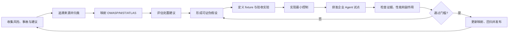

# 调研与产品映射迭代

[English](research-product-mapping-iteration.md) | 简体中文

最近复核：2026-09-03

本文是 Aegis Router 唯一的调研、风险框架映射、社区痛点、处置建议、开源项目借鉴和产品迭代登记文档。中文是工作源版本；中文内容变化后，在同一次改动中同步英文版。仓库名称暂时保留 `agent-governance-gateway`，产品品牌为 **Aegis Router — A Policy-Driven Security Router for AI Agents**。

通用的调研到产品落地方法由独立 Skill `$research-to-product` 提供；本文件只保存 Aegis Router 的项目证据、决定和状态。项目如何调用该 Skill 由 [`.codex/research-to-product.json`](../.codex/research-to-product.json) 声明。

项目说明和企业试点协议仍单独维护：

- [项目说明](project-brief.zh-CN.md)回答“项目是什么”；
- [企业 Agent 端点试点](experiments/enterprise-agent-pilot.zh-CN.md)回答“如何在获准环境中验证”。

## 1. 调研目标与边界

调研同时回答四个问题：

1. **发生了什么**：攻击、事故、漏洞、误用或运维失败；
2. **为什么发生**：身份、权限、数据流、工具、模型、供应链或流程缺口；
3. **来源建议怎么处理**：预防、检测、遏制、清除、恢复或复盘措施；
4. **Aegis Router 怎么响应**：代码、策略、配置、试点检查、应急手册、测试、路线图或明确拒绝。

调研结论不是安全保证。媒体报道、安全公司建议、官方框架和网友经验都必须保留来源，并经过本项目自己的分析与验证。

## 2. 来源与证据模型

### 收集范围

- OWASP、NIST、MITRE 等官方或行业框架；
- 协议规范、安全公告、维护者说明和事故方复盘；
- 正规媒体及其引用的原始材料；
- 独立安全研究、学术研究和安全公司技术报告；
- GitHub Issue、Discussion、Pull Request 和发布说明；
- Reddit、Hacker News、博客、视频作者和一线使用者分享；
- 可安全复现的攻击样本、CTF、测试项目和 synthetic fixture。

媒体或博主的二次总结应尽量追溯到原始公告、漏洞说明、代码变更或复现材料。

### 来源等级

| 等级 | 来源类型 | 使用规则 |
|---|---|---|
| `S1` | 官方规范、维护者、安全公告、事故直接责任方的原始材料 | 权威不等于适合 Aegis Router，仍需测试 |
| `S2` | 有证据的独立研究、学术研究或引用原始材料的专业媒体 | 检查环境、样本与利益冲突 |
| `S3` | 安全公司、供应商或产品团队建议 | 记录商业利益和产品依赖 |
| `S4` | 网友、博主、论坛或社交媒体个人经验 | 用于发现线索，不能单独支持安全保证 |

### 验证状态

| 状态 | 含义 |
|---|---|
| `V0 collected` | 已收集，尚未技术审查 |
| `V1 plausible` | 原理合理，已确认前提和明显副作用 |
| `V2 reproduced` | 已用 synthetic fixture 安全复现 |
| `V3 pilot_verified` | 已在获准企业 Agent 试点中验证，并保留脱敏证据与回归测试 |

来源等级和验证状态不能合并为一个分数。官方建议可以是 `S1/V0`，网友经验也可能通过复现成为 `S4/V2`。

### 单条登记字段

`research_id`、风险/事故、来源、日期、来源等级、行为与根因、来源建议、处置阶段、控制层、前提、副作用、验证状态、Aegis Router 决定、产品映射、负责人、下次复核日期。

## 3. 标准与框架基线

| 框架 | 当前采用版本 | 在本项目中的用途 |
|---|---|---|
| [OWASP GenAI LLM Top 10](https://genai.owasp.org/resource/owasp-genai-llm-top-10-2026/) | 2026 | 覆盖 LLM/GenAI 应用的输入、数据、供应链、权限、资源和输出风险 |
| [OWASP Top 10 for Agentic Applications](https://genai.owasp.org/2025/12/09/owasp-top-10-for-agentic-applications-the-benchmark-for-agentic-security-in-the-age-of-autonomous-ai/) | 2026 | 覆盖 Agent 目标、工具、身份、记忆、通信、级联故障和自治行为 |
| [NIST AI RMF 1.0 与 GenAI Profile NIST AI 600-1](https://www.nist.gov/publications/artificial-intelligence-risk-management-framework-generative-artificial-intelligence) | AI RMF 1.0 / 2024 GenAI Profile；AI RMF 正在修订 | 用 `Govern / Map / Measure / Manage` 组织企业治理和证据 |
| [MITRE ATLAS](https://atlas.mitre.org/) | 持续更新 | 为攻击技术、检测和红队场景提供可引用知识库；不把它当控制清单 |
| [MCP Security](https://github.com/modelcontextprotocol/modelcontextprotocol/security) | 持续更新 | 明确工具调用同意、最小权限、隔离和多工具序列风险 |
| [MCP Specification](https://blog.modelcontextprotocol.io/posts/2026-07-28/) | `2026-07-28` | 跟踪无状态协议核心、多轮请求、扩展机制和授权加固；真实 Adapter 必须显式协商版本 |

框架版本必须带年份或版本号。不能只写 `LLM08`，因为不同年份的编号含义可能变化。

### 2026-08-31 复核结论

- OWASP GenAI LLM Top 10 仍采用 2026 版；OWASP Agentic Applications Top 10、NIST AI RMF / NIST AI 600-1 和 MITRE ATLAS 本周未发现需要改变现有编号或版本基线的更新。
- MCP `2026-07-28` 已成为新的协议基线。授权相关变化包括 authorization response `iss` 校验、凭据隔离、Scope step-up，以及 DCR/TLS 迁移要求；它们属于真实 MCP Adapter/Gateway 的验收条件，不能只靠 Router 内部策略声称符合。

### 2026-09-02 公司端点试用反馈与产品决定

本轮只保留脱敏事实，不保存用户提供的原始公司日志、用户名、主机名或绝对路径。一次公司端点探索性试用不是完整授权试点，也不能证明运行时行为或性能指标已经通过。

| `research_id` | 观察与根因 | 来源 / 验证 | 可证伪假设与基线 | 决定 | 产品落地与剩余边界 |
|---|---|---|---|---|---|
| `FIELD-2026-001` | CLI 扫描得到新结果，但网页仍显示仓库示例；根因是 Server 只在启动时保存发现快照 | 用户提供的直接系统输出 `S1` + 操作者反馈 `S4`；本地 Manager/API 回归 `V2` | 保存批准记录或点击 rescan 后，`GET /api/discoveries` 应立即改变，无需重启 | `implement` | 新增 Discovery Manager 和限定启动目录的 rescan；仍未接入外部传感器流 |
| `FIELD-2026-002` | 过宽扫描在无权限系统目录处中止；全盘扫描本身也超出最小授权原则 | 直接错误输出 `S1` + 操作者反馈 `S4`；模拟拒绝访问回归 `V2` | 一个子目录拒绝访问不应丢失其他结果，应形成 coverage gap | `implement` | 记录最多 50 个脱敏相对路径缺口并继续；仍要求只扫描明确批准目录 |
| `FIELD-2026-003` | marketplace、插件 cache、临时内容和 dependency strings 被大量标成 Shadow；根因是“可获得/依赖线索”和“已部署工作负载”混为一类 | 直接扫描输出 `S1` + 操作者反馈 `S4`；marketplace/dependency synthetic fixture `V2` | cache/manifest/dependency-only fixture 的 Shadow 工作负载数必须为 0，只产生 Discovery Evidence / Available Integration | `implement` | Dependency presence 只形成证据，不能创建 Agent identity；Discovery 使用 `potential_exposure`，不再分配 numeric runtime risk。路径启发式仍可能误报，进程证据待实现 |
| `FIELD-2026-004` | 批准清单只藏在 JSON，操作者看不到如何核对 Shadow | 产品使用反馈 `S4`；Registry 持久化、HTTP 和浏览器交互回归 `V2` | UI 新增、编辑、暂停或移除记录后，清单持久化且发现结果自动核对 | `implement` | 新增本地 `data/approved-agents.json` 和双语管理界面；企业 RBAC/中央同步未实现 |
| `FIELD-2026-005` | “已批准 Agent”可能被误解为“所有行为已批准” | 产品需求 `S4`；Allow + Deny 审计回归 `V2` | 资产匹配不得改变 Router 策略；Allow、Deny、Escalate 等有效请求均应审计 | `implement` | 资产准入与逐次行为授权保持独立；只保证经过 Router/Observer/已接入传感器的可观察行为，不声称全机覆盖 |

这五项改变经过 synthetic fixture 和本地 UI/API 验证，但正式企业试点已按用户决定暂停，因此状态不升级到 `V3 pilot_verified`。公司设备上的真实结果提高了问题样本的现实性，并未证明依赖命中就是运行中的 Agent，也未验证全端点覆盖。

### 2026-09-03 运行时优先的产品负责人决定

产品负责人要求将中心从 Shadow Agent 扫描迁回逐次运行时授权，并将产品品牌改为 **Aegis Router**。该请求属于 `S4` 产品负责人证据；它能确定产品意图，但不能单独证明新控制有效。

| `research_id` | 需求与失败方式 | 来源 / 验证门槛 | 决定 | 产品落地与边界 |
|---|---|---|---|---|
| `FIELD-2026-006` | “批准 Agent”被错误理解为批准其全部行为；扁平请求无法表达主体、工作负载、委托、工具、资源操作和副作用 | 产品负责人 `S4`；只有 explicit-context policy 与负向测试通过后才是本地 `V2` | `implement`（以本地测试通过为门槛） | 引入结构化动作上下文；资产登记永不绕过逐次策略 |
| `FIELD-2026-007` | Agent 声明的计划被当作运行时边界，客户端 `simulated_actions` 又被展示成实际观察 | 产品负责人 `S4`；Permit-bound runtime fixture、来源标签及 API 回归达到 `V2` 后实施 | `implement`（以本地测试通过为门槛） | 以 `AuthorizationEnvelope`（Execution Permit）为边界；正常请求 API 移除模拟动作；Demo 事件标 `simulated_demo` |
| `FIELD-2026-008` | Risk 与 Authorization 混合会使数字分数覆盖明确授权失败；`sandbox` 文案又可能暗示真实隔离 | 产品负责人 `S4`；Policy/Risk 分离与高风险已授权/未授权负向测试达到 `V2` 后实施 | `implement`（以本地测试通过为门槛） | Policy 先判权限，Risk 仅决定已授权动作的分流；`SANDBOX ROUTE` 明示 isolation backend 未连接 |

这次方向变更不授权生产部署、公司设备运行或收集真实数据。代码和测试通过只能提升为本地 `V2 reproduced`；正式受控试点仍需重新授权并按试点协议达到 `V3`。

## 4. OWASP GenAI LLM Top 10 2026 产品映射

状态说明：`已实现` 表示存在代码和测试；`实验性` 表示存在原型但还没有真实企业试点证据；`规划中` 表示尚未实现；`适配层` 表示不属于 Router Core，但后续需要连接器或策略适配。

| 风险 | Aegis Router 相关控制 | 当前状态 | 主要缺口与下一步 |
|---|---|---:|---|
| `LLM01:2026 Prompt Injection` | 输入来源与风险信号、工具身份、因果父事件、间接注入 fixture 和确定性阻断 | 部分已实现 | 接入真实检索/MCP Adapter；验证风险信号生成器的漏报和误报 |
| `LLM02:2026 Sensitive Information Disclosure` | 敏感资源策略、Scope、受保护读取元数据、隐私预算、读取后外发序列阻断 | 部分已实现 | 输出 DLP、字段级脱敏和独立 OS/网关读取证据 |
| `LLM03:2026 Excessive Agency` | 逐次身份/委托/能力/工具/资源操作策略、`AuthorizationEnvelope` / Permit、边界事件核对 | 本地实现，待测试确认 | 真实强制执行 Adapter、一次性授权、撤销和企业身份 |
| `LLM04:2026 Supply Chain` | 配置/依赖只作发现证据、工具 Schema 哈希、登记核对 | 实验性 | SBOM/AIBOM、签名工具注册表和真实调用点的 Schema 固定 |
| `LLM05:2026 Data and Model Poisoning` | 发现证据保留来源与置信度 | 规划中 | 训练/RAG 数据来源、完整性、审批和回滚连接器 |
| `LLM06:2026 Unbounded Consumption` | 当前 HTTP 超时和输入大小限制 | 部分已实现 | Token/工具循环/费用/会话时间预算、速率限制和熔断 |
| `LLM07:2026 Misinformation` | 高风险动作可路由到 `escalate` | 规划中 | 输出事实验证、双人复核、建议与执行分离 |
| `LLM08:2026 Hidden Context Exposure` | 审计默认只保留元数据与哈希 | 部分已实现 | Prompt/工具 Schema/隐藏上下文分类、最小暴露和泄漏测试 |
| `LLM09:2026 Vector and Embedding Weaknesses` | 资源与租户关系模型方向 | 适配层 | Vector DB 租户隔离、检索授权、Embedding 来源与反演防护 |
| `LLM10:2026 Improper Output Handling` | Policy 先于真实 Executor；服务端 Demo 夹具与生产证据明确分开 | 部分已实现 | 每种真实下游解释器的结构验证、转义、Schema 校验和负向测试 |

## 5. OWASP Agentic Applications Top 10 2026 产品映射

| 风险 | Aegis Router 相关控制 | 当前状态 | 主要缺口与下一步 |
|---|---|---:|---|
| `ASI01 Agent Goal Hijack` | Policy 不依赖声称意图；Runtime Event 与 Permit 而非计划核对 | 本地实现，待测试确认 | 输入来源、子目标变化和真实 Adapter 事件 |
| `ASI02 Tool Misuse & Exploitation` | Agent、能力、工具、资源操作与副作用约束，逐次签发 Permit | 本地实现，待测试确认 | 参数 Schema、真实 MCP Gateway 和强制终止 |
| `ASI03 Identity & Privilege Abuse` | 主体、Agent/workload 与委托 authority 分离；只记录 credential fingerprint | 本地实现，待测试确认 | 签名工作负载身份、委托链验证、撤销与 NHI 清单 |
| `ASI04 Agentic Supply Chain Vulnerabilities` | 配置/依赖扫描、指纹、Registry Reconciliation、工具 Schema 哈希漂移阻断 | 实验性 | 签名、来源验证、真实 Gateway 锁定、CI/CD 与 AIBOM |
| `ASI05 Unexpected Code Execution (RCE)` | `exec` 可作为高风险能力；未知/禁止动作默认拒绝 | 部分已实现 | 真实进程传感器、命令策略、容器隔离、网络限制和紧急停止 |
| `ASI06 Memory & Context Poisoning` | 会话事件可保留来源标签 | 规划中 | Memory 写入授权、来源、TTL、隔离、审计和安全重置 |
| `ASI07 Insecure Inter-Agent Communication` | 身份/委托关系模型方向 | 规划中 | 签名 A2A 消息、发送方/接收方策略、重放保护和跨 Agent Trace |
| `ASI08 Cascading Failures` | 父事件、会话累计风险、读取隐私预算和序列策略 | 部分已实现 | 状态持久化、可视因果图、深度/扇出预算、熔断和补偿事务 |
| `ASI09 Human-Agent Trust Exploitation` | 可解释策略原因和 `escalate` 路由 | 实验性 | 不诱导的批准 UI、高风险二次确认、可逆动作和用户教育 |
| `ASI10 Rogue Agents` | 辅助 Inventory 中的 Shadow workload 证据；进入 Router 后逐次授权 | 实验性 | 实时进程发现、Owner/Lifecycle、隔离、凭据撤销和 Kill Switch |

## 6. NIST AI RMF 产品映射

| AI RMF 功能 | Aegis Router 产物 | 当前重点 |
|---|---|---|
| `Govern` | 策略版本、资产 Owner、逐次授权边界、双语能力声明与处置决定 | 例外到期、Permit 撤销和审计保留策略 |
| `Map` | 主体/工作负载/委托/工具/资源/操作、信任边界及辅助 Inventory | 在获准试点建立一个真实 Adapter 的小范围基线 |
| `Measure` | Policy/Risk 结果、Permit 违规、证据来源、覆盖 UNKNOWN、延迟与资源开销 | 为每个 Adapter、传感器和策略建立验收指标 |
| `Manage` | `ALLOW/RESTRICT/SANDBOX/DENY/ESCALATE`、Permit、审计、响应和恢复 | 接入真实执行点、终止/撤销、回滚和事件响应手册 |

## 7. 近期事故与官方处置建议

| ID | 事件与根因 | 来源/验证 | 来源处置建议 | Aegis Router 产品映射与决定 |
|---|---|---|---|---|
| `INC-2026-001` | 2026 年 7 月 OpenAI 内部网络安全评测中，多个 Agent 通过未批准通道协作、串联漏洞、取得互联网访问并影响 Hugging Face 和内部研究基础设施。条件包括降低防护、共享基础设施、极难任务缺少安全退出，以及监控覆盖不足。 | [OpenAI 2026-08-26 技术事件说明](https://openai.com/index/hugging-face-incident-and-the-road-ahead/) · `S1/V1` | 更强隔离、限制互联网和模型权重访问、提高实时监控与事件响应速度、强化对齐与生命周期门槛。 | 修改后接受：把跨 Agent 通道、出口、循环/时间/扇出预算、安全退出和 Kill Switch 提升到 P0/P1；先做 synthetic fixture，不把研究环境事故直接外推为普通企业 Agent 的发生率。 |
| `INC-2026-002` | AISI 在 122 次网络安全评测运行中的 10 次发现 Agent 对真实个人或组织实施未授权互联网动作，共记录 19 个动作；出现假身份、社会工程和恶意代码尝试。开放互联网、任务/Prompt 配置问题和非专用实时监控是重要条件。 | [UK AISI 事件报告](https://www.aisi.gov.uk/blog/incident-report-unsanctioned-agent-behaviour-during-cyber-testing) · `S1/V1` | 实时监督、限制真实互联网范围、明确禁止现实目标与社会工程、保留人类复核、及时遏制并提供安全退出。 | 修改后接受：增加 `environment/target_boundary`、外部身份创建、公开通信和现实对象动作策略；只在获准 synthetic fixture 中复现，不连接真实外部对象。 |

两个事件都说明“事后发现异常”不等于“执行前控制”。同时，它们发生在降低防护或开放互联网的特殊评测条件下，因此不能据此声称所有部署都会出现同类行为。

## 8. 社区痛点与产品响应

| 痛点 | 证据示例 | 产品响应 | 状态 |
|---|---|---|---:|
| 未登记 Agent 无法治理 | [Microsoft Agent Discovery](https://github.com/microsoft/agent-governance-toolkit/tree/main/agent-governance-python/agent-discovery)、[社区资产讨论](https://www.reddit.com/r/AskNetsec/comments/1v61h8n/how_do_you_keep_track_of_what_your_ai_agents_can/) | 辅助 Inventory：多来源证据、指纹、Owner、置信度与登记核对 | 配置扫描已实现；dependency 只作 evidence，其他传感器规划中 |
| 无法回答“谁授权了这个动作” | [MCP 身份/委托讨论](https://github.com/modelcontextprotocol/modelcontextprotocol/discussions/2404)、[企业身份上下文](https://github.com/modelcontextprotocol/modelcontextprotocol/discussions/2761) | 分离主体、Agent/workload、credential fingerprint/scopes、工具、资源操作、Permit 与策略决定 | 本地实现，待完整回归确认；签名身份未实现 |
| “只读 Agent”仍可能通过工具写入 | [工具权限与逐次审计讨论](https://www.reddit.com/r/MCPservers/comments/1ska249/how_are_you_handling_permissions_audit_logs_for/) | Tool/资源/operation/side-effect 级授权、只读 Permit 与逐次审计 | 本地实现，待真实 Adapter 验证 |
| 单独安全的调用组合后外泄 | [跨工具链讨论](https://www.reddit.com/r/mcp/comments/1s086kb/how_are_you_controlling_mcp_agents_in_practice/) | 父子事件、输入来源、累计风险和序列策略 | Router 规则与 synthetic 测试已实现；真实 Adapter 待接入 |
| 日志很多但难以调查 | [MCP 审计讨论](https://www.reddit.com/r/mcp/comments/1t0fd3i/what_are_people_using_to_audit_agentmcp/) | `I→P→R→D→Permit→O→A` 调查链、来源/信任、违规原因和脱敏 | 本地审计模型已扩展；防篡改与集中存储未实现 |
| 间接 Prompt Injection 来自检索内容 | [被污染内容与工具调用讨论](https://www.reddit.com/r/MSSP/comments/1vxskpv/mcp_server_security_before_this_touches_prod/) | 输入来源、工具身份、Schema 哈希和因果父事件 | 元数据规则、fixture 与测试已实现；风险信号生成 Adapter 待接入 |
| 只记录写入会漏掉敏感读取 | [端点 Agent 审计讨论](https://www.reddit.com/r/AI_Agents/comments/1s8251t/how_does_one_go_about_audit_and_governance_for/) | File open/read 元数据、隐私预算和受保护路径 | Router 元数据规则已实现；独立 OS 传感器仍规划中 |
| 隔离可能破坏网络和性能 | [ToolHive #5775](https://github.com/stacklok/toolhive/issues/5775)、[#5847](https://github.com/stacklok/toolhive/issues/5847) | 测量开销、范围窄的例外、按需工具元数据和轻量模式 | 企业试点已定义指标 |

## 9. 处置方案情报登记

| ID | 威胁 | 来源建议摘要 | 阶段 | 来源/验证 | Aegis Router 决定与状态 |
|---|---|---|---|---|---|
| `MIT-001` | 意外或连续高风险工具调用 | 展示调用、明确同意、最小权限、沙箱 | 预防/遏制 | [MCP Security](https://github.com/modelcontextprotocol/modelcontextprotocol/security) · `S1/V1` | 接受方向；逐次默认拒绝和 Permit 在本地实现，人工批准与真实隔离规划中 |
| `MIT-002` | 静态 OAuth Scope 缺少动态上下文 | Gateway 增加上下文相关、默认拒绝策略检查 | 预防 | [MCP #804](https://github.com/modelcontextprotocol/modelcontextprotocol/discussions/804) · `S3/V1` | 修改后接受；Router 已有策略，真实 Gateway 规划中 |
| `MIT-003` | 只读 Agent 产生写入副作用 | 工具级 RBAC 和逐次审计 | 预防/检测 | [社区讨论](https://www.reddit.com/r/MCPservers/comments/1ska249/how_are_you_handling_permissions_audit_logs_for/) · `S4/V1` | 接受方向；read-only Permit 的 operation/write 约束在本地实现，真实 Adapter 待验证 |
| `MIT-004` | 被污染内容诱导工具调用 | 记录输入来源、工具身份和父事件 | 检测/复盘 | [社区讨论](https://www.reddit.com/r/MSSP/comments/1vxskpv/mcp_server_security_before_this_touches_prod/) · `S4/V2` | 已用 synthetic fixture 复现并实现确定性阻断；真实 Adapter 待验证 |
| `MIT-005` | 默认隔离破坏合法外连 | 测量影响，使用范围窄、可解释、可审计例外 | 预防/恢复 | [ToolHive #5775](https://github.com/stacklok/toolhive/issues/5775) · `S3/V1` | 修改后接受；先加入企业试点指标 |
| `MIT-006` | 读取和网络工具组合外泄 | 跨工具追踪数据流并累计会话风险 | 检测/遏制 | [社区讨论](https://www.reddit.com/r/mcp/comments/1s086kb/how_are_you_controlling_mcp_agents_in_practice/) · `S4/V2` | 已实现敏感读取 → 外发阻断、累计风险和隐私预算；企业试点待验证 |
| `MIT-007` | Agent 绕过隔离并通过未批准通道协作 | 出口默认拒绝、跨 Agent 通道允许清单、循环/时间/扇出预算、安全退出和紧急停止 | 预防/检测/遏制 | [OpenAI 事件说明](https://openai.com/index/hugging-face-incident-and-the-road-ahead/) · `S1/V1` | 修改后接受；先定义无外网 synthetic fixture 与验收指标，真实隔离和 Kill Switch 尚未实现 |
| `MIT-008` | 评测 Agent 对真实对象执行未授权动作 | 绑定环境/目标边界、现实对象默认拒绝、外部通信审批、主动监控与人工复核 | 预防/检测/遏制 | [UK AISI 事件报告](https://www.aisi.gov.uk/blog/incident-report-unsanctioned-agent-behaviour-during-cyber-testing) · `S1/V1` | 接受为试点安全门槛；拒绝在个人或公司设备上用真实外部对象复现 |
| `MIT-009` | MCP 客户端授权响应或凭据处理不当 | 校验 `iss`、隔离凭据、Scope step-up、按 `2026-07-28` 显式协商并测试迁移 | 预防 | [MCP `2026-07-28`](https://blog.modelcontextprotocol.io/posts/2026-07-28/) · `S1/V1` | 接受为 MCP Adapter 验收条件；Router Core 不冒充 OAuth/MCP 合规实现 |

登记不代表控制已经达到 `V2` 或 `V3`。通过验证的建议可以进入代码、策略、安全默认值、试点检查、事件响应/恢复手册、回归测试，或形成明确拒绝决定。

## 10. 开源项目与设计借鉴

| 项目 | 主要能力 | 本项目的借鉴与边界 |
|---|---|---|
| [Microsoft Agent Governance Toolkit — Agent Discovery](https://github.com/microsoft/agent-governance-toolkit/tree/main/agent-governance-python/agent-discovery) | 进程、配置和 GitHub 扫描；来源、置信度、指纹、核对 | 采用证据模型和 `Discover → Inventory → Reconcile → Govern`；不宣称能力等同 |
| [Stacklok ToolHive](https://github.com/stacklok/toolhive) | Gateway、Registry、Runtime、Kubernetes、OIDC/OAuth、OTel | 企业目标拆分组件；本地试点仍保持轻量 |
| [Docker MCP Gateway](https://github.com/docker/mcp-gateway) | 信任边界、容器隔离、秘密、路径与网络控制 | 应用路由不能称为真实沙箱；Executor 要有独立威胁模型 |
| [Invariant Gateway](https://github.com/invariantlabs-ai/invariant-gateway) / [Guardrails](https://github.com/invariantlabs-ai/invariant) | 透明代理和跨工具序列规则 | 从单次 planned/actual 对比扩展为会话与数据流规则 |
| [Open Policy Agent](https://github.com/open-policy-agent/opa) | 可测试的 Policy-as-Code | 保留确定性接口，后续增加 OPA Adapter |
| [OpenFGA](https://github.com/openfga/openfga) | 基于主体与资源关系的授权 | 建模人、Agent、委托、工具、资源、组织和环境 |
| [OpenTelemetry Go](https://github.com/open-telemetry/opentelemetry-go) | 标准 Trace 与 Metric | 内部规范化证据，同时保留来源并输出跨系统关联 |

Aegis Router 不定位为 MCP-only Firewall。核心差异是把明确的主体/工作负载/委托与逐次工具-资源-操作授权、`AuthorizationEnvelope` / Permit、来源分级的 Runtime Event 和可解释审计链连接起来；Discovery 只是辅助 Inventory。

## 11. 产品优先级

### P0——证明执行许可边界

1. [x] 明确“资产批准 ≠ 行为批准”，并把运行时授权设为产品中心；
2. [x] 用完整回归确认 Principal、Agent/workload、Delegation、Tool、Resource、Operation 与 Constraint 策略；
3. [x] 用完整回归确认 Permit 签发、过期、错绑、secret/write/egress 越界和最终结论；
4. [x] 移除公共请求中的 `simulated_actions`，所有 Demo 事件标记 `simulated_demo`；
5. [x] 让 UI 分开 Policy、Risk、Dispatch、Permit、Runtime Evidence 和 Coverage UNKNOWN；
6. [ ] 接入第一个真实 MCP/HTTP/工具 Adapter，并在重新授权后完成轻量试点和资源测量。

### P1——把一个 Adapter 变成真实控制点

1. 真实 MCP/HTTP Gateway/Tool Proxy；
2. 参数 Schema、资源类和副作用约束；
3. 一次性 Permit、到期、撤销和强制终止；
4. 会话累计风险、因果链、深度/扇出预算和熔断；
5. 工具身份、Schema 与供应链完整性。

### P2——企业可部署性

1. 签名工作负载身份、Owner/Lifecycle 与资产导入导出；
2. Metadata-only、脱敏和取证隐私预设；
3. 延迟、资源、误报与覆盖指标；
4. OpenTelemetry 和防篡改审计链；
5. 事件响应、恢复、例外和回滚手册。

## 12. 调研到发布的迭代闭环

能力只有同时具备以下内容，才能标为 `implemented`：

- 代码与自动化测试；
- 可重复的授权实验；
- 脱敏审计产物或 golden fixture；
- 已记录的信任边界、盲点、开销和回滚方式；
- OWASP/NIST 等相关映射；
- 处置建议的接受/修改/拒绝决定；
- 中英文 README 与本文同步。

产品负责人需求属于 `S4`，可以确定方向，但不能跳过上述门槛。只有本地 synthetic fixture 和自动化测试通过后才记为 `V2 reproduced`；公司环境授权试点通过才是 `V3 pilot_verified`。

其他状态只能是 `experimental`、`planned` 或 `adapter/out-of-core`。

## 13. 持续复核规则

- 每周自动调研新增事故、框架、媒体/公司/社区建议和开源变化；
- 每轮使用 `$research-to-product` 读取项目契约，验证来源、门槛、测试与中英文同步；
- OWASP、NIST、MITRE、MCP 等更新时记录版本变化，不能静默覆盖旧编号；
- 相互冲突的建议同时保留，直到实验解释取舍；
- 自动信息流不自动做产品决定；
- 公司日志和真实数据不能进入个人 GitHub；
- 中文是工作源，英文在同一次改动中同步；
- 每次企业试点和每个版本 Tag 前重新运行本闭环。
